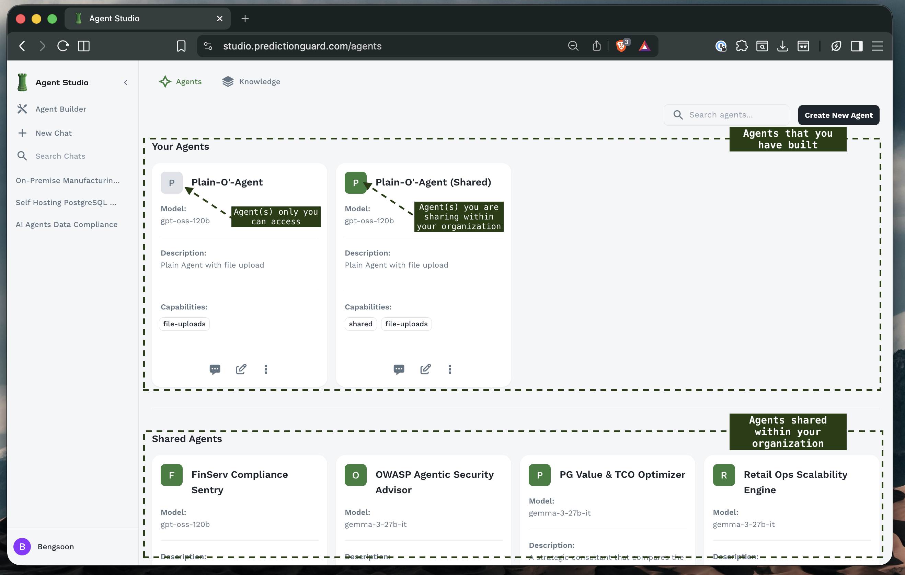
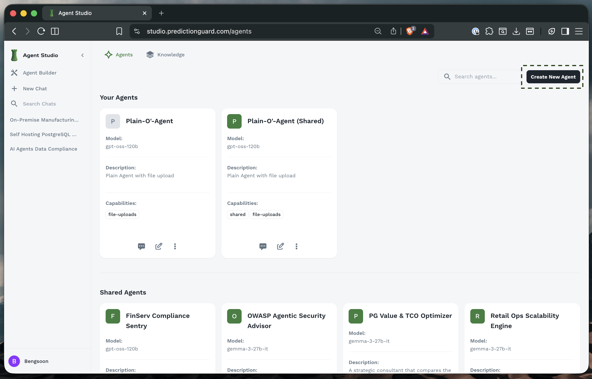
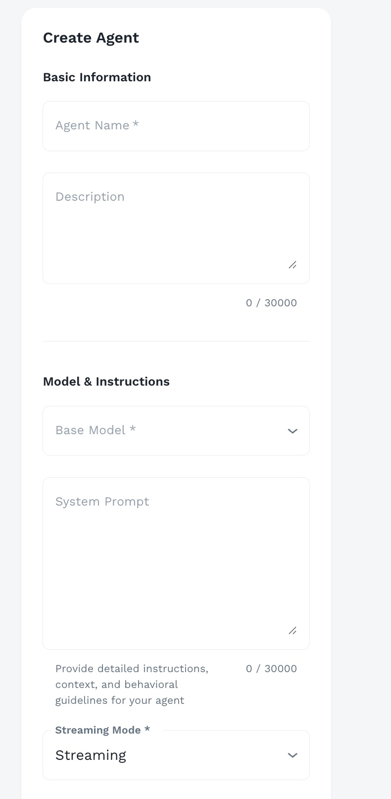
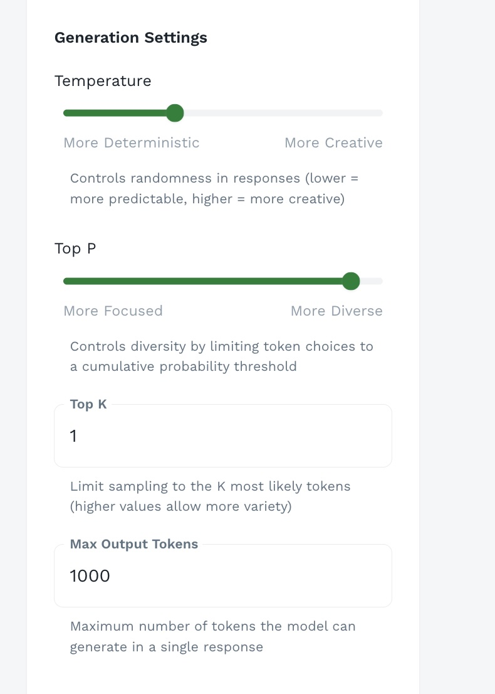
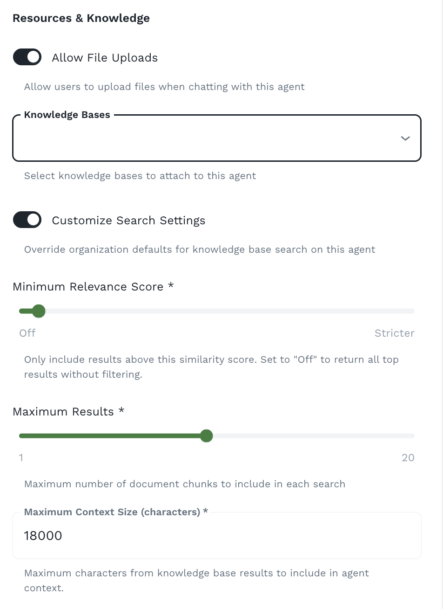

## Agent Builder Overview

Access the Agent Builder from the left sidebar to create and manage your agents.



The Agent Builder provides:
- **Your Agents**: Personal agents you've created
- **Shared Agents**: Organization-wide agents
- **Create New Agent**: Button to start building
- **Search**: Find agents by name or description
- **Agent Management**: Edit, duplicate, or delete agents

## Creating Your First Agent

### Starting the Creation Process



1. **Click "Create New Agent"** in the top-right corner
2. You'll be directed to the **agent configuration form**
3. The form is organized into **sections** for different aspects of your agent

<Callout intent="info">
**Tip**: Plan your agent's purpose before starting. Consider what tasks it will perform, what knowledge it needs, and who will use it.
</Callout>

## Basic Information

The first section covers fundamental agent details.



### Agent Name

**Purpose**: A clear, descriptive name for your agent

**Best Practices**:
- Use **descriptive names** that indicate the agent's purpose
- Include **domain or function**: "FinServ Compliance Sentry", "Code Review Assistant"
- Keep it **concise but meaningful**: 2-5 words ideal
- Consider **naming conventions** for your organization

### Description

**Purpose**: Explain what your agent does and when to use it

**What to Include**:
- **Primary function**: What the agent specializes in
- **Use cases**: When to use this agent
- **Capabilities**: What it can help with
- **Limitations**: What it cannot do

## Model & Instructions

This section defines your agent's intelligence and behavior.

### Base Model Selection

**Purpose**: Choose the underlying large language model

**Available Models** (vary by deployment):
- **gemma-3-27b-it**: Google’s instruction-tuned open-weight model built for balanced performance across diverse tasks.
- **gpt-oss-120b**: OpenAI’s open-weight model designed for powerful reasoning, agentic tasks, and versatile developer use cases.
- **Hermes-3-Llama-3.1-8B**: General use model that excels at reasoning and multi-turn conversations, with an improved focus on longer context lengths.
- **Qwen2.5-Coder-14B-Instruct**: Designed to enhance code generation, reasoning, and fixing, making it a powerful tool for developers.
- **Qwen2.5-VL-7B-Instruct**: Multimodal vision-language mode that excels in analyzing images, video and text.

**Choosing the Right Model**:

| Use Case | Recommended Model | Reason |
|----------|-------------------|---------|
| Quick responses, high volume | Smaller models (8B) | Faster inference, lower cost |
| Complex reasoning | Larger models (27B+) | Better understanding, nuanced responses |
| Code generation | Code-specialized models | Better syntax and logic |

<Callout intent="success">
**Tip**: Start with a mid-size model and adjust based on performance. Smaller models are often sufficient for focused tasks with good prompts.
</Callout>

### System Prompt

**Purpose**: Define your agent's personality, expertise, and behavior

**The Most Important Configuration**: Your system prompt determines how your agent thinks and responds.

#### System Prompt Structure

A well-crafted system prompt includes:

**1. Role Definition**
```
You are a financial services compliance expert specializing in
regulatory requirements for banking and fintech companies.
```

**2. Core Responsibilities**
```
Your primary responsibilities:
- Answer questions about financial regulations (SOX, GDPR, PCI DSS)
- Assess compliance risks in business processes
- Provide guidance on regulatory requirements
- Suggest compliance best practices
```

**3. Knowledge Scope**
```
You have deep expertise in:
- US financial regulations (Dodd-Frank, SOX, BSA/AML)
- European regulations (GDPR, MiFID II, PSD2)
- Payment card industry standards (PCI DSS)
- Data protection and privacy laws
```

**4. Behavioral Guidelines**
```
When responding:
- Always cite specific regulations when applicable
- Highlight potential risks clearly
- Provide actionable recommendations
- Acknowledge when unsure and suggest consulting legal counsel
- Use clear, professional language
```

**5. Limitations**
```
Important limitations:
- You are not a lawyer; responses are informational, not legal advice
- Always recommend consulting qualified legal professionals for final decisions
- You cannot guarantee regulatory compliance
```

#### System Prompt Best Practices

**Be Specific**:
❌ "You are a helpful assistant"
✅ "You are a cybersecurity expert specializing in OWASP Top 10 vulnerabilities and secure coding practices for web applications"

**Define Expertise Boundaries**:
```
You specialize in Python and JavaScript security.
For questions about other languages, acknowledge your
limitations and suggest consulting language-specific experts.
```

**Set Response Format**:
```
Structure your responses as:
1. Summary (2-3 sentences)
2. Detailed Analysis
3. Recommendations (numbered list)
4. References (if using knowledge base)
```

**Include Safety Guidelines**:
```
Never provide information that could:
- Bypass security controls
- Violate privacy regulations
- Harm users or systems
- Violate ethical guidelines
```

**Use Examples in Prompts**:
```
When explaining code vulnerabilities, provide:
- Example vulnerable code
- Explanation of the risk
- Corrected secure code
- Prevention strategies
```

### Streaming Mode

**Purpose**: Control how responses are delivered

**Options**:
- **Streaming**: Responses appear word-by-word in real-time
- **Non-Streaming**: Complete response delivered at once

**When to Use Streaming**:
- ✅ Interactive conversations
- ✅ Long-form responses
- ✅ Better perceived performance
- ✅ User can see progress

**When to Use Non-Streaming**:
- ✅ Short, quick responses
- ✅ API integrations
- ✅ Batch processing
- ✅ When complete response needed before action
- ✅ When using MCP tool calls

<Callout intent="info">
**MCP requires "Non-streaming (with MCP capabilities)" mode**: If you plan to connect your agent to external tools via [MCP Integration](/agent-forge/using-agent-forge/mcp), make sure you choose the right mode. MCP tool calls execute in real-time and stream results back as they arrive.
</Callout>

## Generation Settings (Advanced Settings)

Fine-tune how your agent generates responses.



### Temperature

**Range**: 0.0 to 1.0

**Purpose**: Controls randomness and creativity in responses

**Scale**:
```
0.0 ←────────────────────→ 1.0
More Deterministic    More Creative
```

**Recommended Settings**:

| Use Case | Temperature | Reasoning |
|----------|-------------|-----------|
| Code generation | 0.1 - 0.3 | Need precise, correct syntax |
| Technical documentation | 0.2 - 0.4 | Accuracy over creativity |
| Customer support | 0.3 - 0.5 | Balanced responses |
| Creative writing | 0.7 - 0.9 | Encourage variety |
| Brainstorming | 0.8 - 1.0 | Maximum diversity |
| Data extraction | 0.0 - 0.2 | Strict adherence to format |

<Callout intent="warning">
**Important**: For factual, compliance, or safety-critical applications, use **lower temperature** (0.0-0.3) to ensure consistent, accurate responses.
</Callout>

### Top P (Nucleus Sampling)

**Range**: 0.0 to 1.0

**Purpose**: Controls diversity by limiting token choices to a cumulative probability threshold

**Scale**:
```
0.0 ←────────────────────→ 1.0
More Focused         More Diverse
```

**How It Works**:
- Model ranks all possible next tokens by probability
- Top P selects from tokens that cumulatively reach the threshold
- **Lower values** = Consider only most likely tokens (focused)
- **Higher values** = Consider broader range of tokens (diverse)

**Recommended Settings**:
- **0.9-0.95**: Good balance for most applications (default)
- **0.5-0.7**: More focused, consistent responses
- **0.95-1.0**: Maximum diversity for creative tasks

### Top K

**Range**: 1 to unlimited (typically 1-100)

**Purpose**: Limit sampling to the K most likely tokens

**How It Works**:
- Model considers only the K most probable next tokens
- **Lower K** = More focused, repetitive
- **Higher K** = More variety, potential for surprises

**Recommended Settings**:
- **1**: Always pick most likely token (deterministic)
- **10-20**: Focused, consistent responses
- **40-50**: Balanced variety
- **80-100**: High diversity

### Max Output Tokens

**Range**: Varies by model (typically 100-4000+)

**Purpose**: Maximum number of tokens the model can generate in a single response

**Understanding Tokens**:
- Tokens ≠ Words
- **Approximate**: 1 token ≈ 0.75 words (English)
- Example: "Hello, world!" ≈ 3-4 tokens

**Recommended Settings**:

| Use Case | Max Tokens | Reasoning |
|----------|------------|-----------|
| Short answers | 100-300 | Quick facts, definitions |
| Standard responses | 500-1000 | Detailed explanations |
| Long-form content | 1500-2500 | Articles, documentation |
| Code generation | 1000-2000 | Complete functions/classes |
| Analysis reports | 2000-4000 | Comprehensive reviews |

## Resources & Knowledge

Configure how your agent accesses and uses organizational knowledge.



### Allow File Uploads

**Purpose**: Enable users to upload files during conversations

**Toggle**: On/Off

**When Enabled**:
- Users can upload documents while chatting
- Agent can read and analyze file contents
- Files persist throughout the conversation

### Knowledge Bases

**Purpose**: Attach organizational knowledge to your agent

**Dropdown**: Select one or more knowledge bases

**How It Works**:
1. User asks a question
2. System performs **semantic search** on attached knowledge bases
3. Relevant documents/chunks retrieved
4. Context added to agent's prompt
5. Agent generates response using knowledge

### Customize Search Settings

**Toggle**: On/Off

When enabled, you can customize:

#### Minimum Relevance Score

**Range**: Off to Stricter

**Purpose**: Only include results above this similarity score

**Settings**:
- **Off**: Return all results, no filtering
- **Low (0.3-0.5)**: Include loosely related documents
- **Medium (0.5-0.7)**: Balance precision and recall
- **High (0.7-0.85)**: Only highly relevant documents
- **Strict (0.85-1.0)**: Only near-exact matches

#### Maximum Results

**Range**: 1 to 20

**Purpose**: Maximum number of document chunks to include in each search

**Recommended Settings**:
- **1-3**: Focused, specific queries
- **5-10**: Standard (balanced)
- **10-20**: Complex queries needing broad context

#### Maximum Context Size

**Range**: Typically 1,000 to 50,000+ characters

**Purpose**: Maximum characters from knowledge base results to include in agent context

**Example**: 18000 characters ≈ 4,500 tokens ≈ 3,000 words

## Access Control & Security

Configure who can use your agent and what security features are enabled.


### Share With Organization

**Toggle**: On/Off

**Purpose**: Make this agent visible to all users in your organization

**When to Share**:
- ✅ General-purpose assistants
- ✅ Company-wide knowledge agents
- ✅ Standard operating procedure guides

### Prompt Injection Protection

**Toggle**: On/Off

**Purpose**: Detect and block prompt injection attacks in user messages

**What It Protects Against**:
- Users trying to override system prompt
- Attempts to extract system instructions
- Malicious prompt manipulation
- Jailbreak attempts

### PII Detection & Replacement

**Toggle**: On/Off

**Purpose**: Automatically detect and replace personally identifiable information in messages

**What It Detects**:
- Names, email addresses, phone numbers
- Social Security Numbers
- Credit card numbers
- Addresses and IP addresses
- Dates of birth

## Topic Filter

Control what subjects your agent can discuss.


### Purpose

Topic filters ensure your agent stays focused on its intended purpose and doesn't respond to off-topic or inappropriate queries.

### Configuration Options

**Allowed Topics** (Whitelist approach):
- Define specific topics agent should address
- Agent politely declines off-topic requests

**Blocked Topics** (Blacklist approach):
- Define topics agent should refuse
- Agent declines these even if otherwise relevant

## Saving and Testing Your Agent

### Saving Your Agent

1. **Review all settings** one final time
2. **Click "Create Agent"** or "Save Changes"
3. Agent is now available for use
4. Appears in "Your Agents" section

### Testing Your Agent

After creation, thoroughly test your agent:

**Basic Functionality**:
1. Start a new chat with your agent
2. Ask typical questions from your use case
3. Verify responses are appropriate
4. Check tone and style match expectations

## Next Steps

Now that you can build agents:

1. **[Configure MCP](/agent-forge/using-agent-forge/mcp)** - Connect your agent to external tools and live data sources
2. **[Create Knowledge Bases](/agent-forge/using-agent-forge/knowledge-base)** - Add organizational knowledge to your agents
3. **[Share with Team](/agent-forge/using-agent-forge/chatting-with-agents)** - Enable organization sharing and collaborate