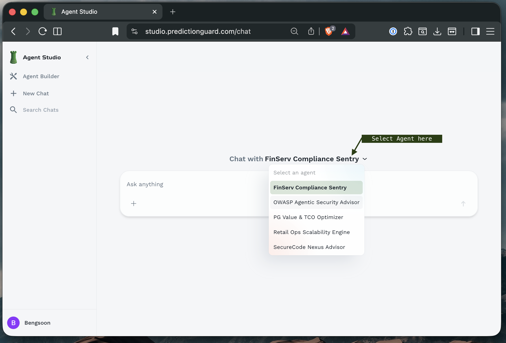
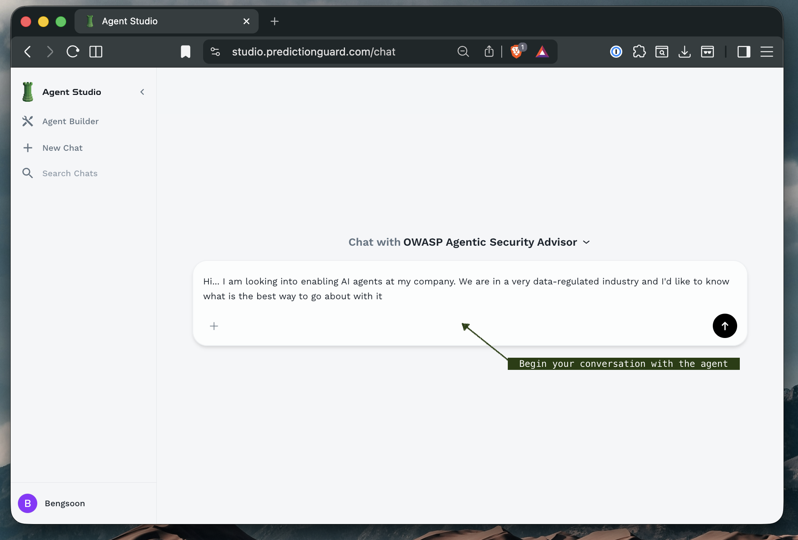
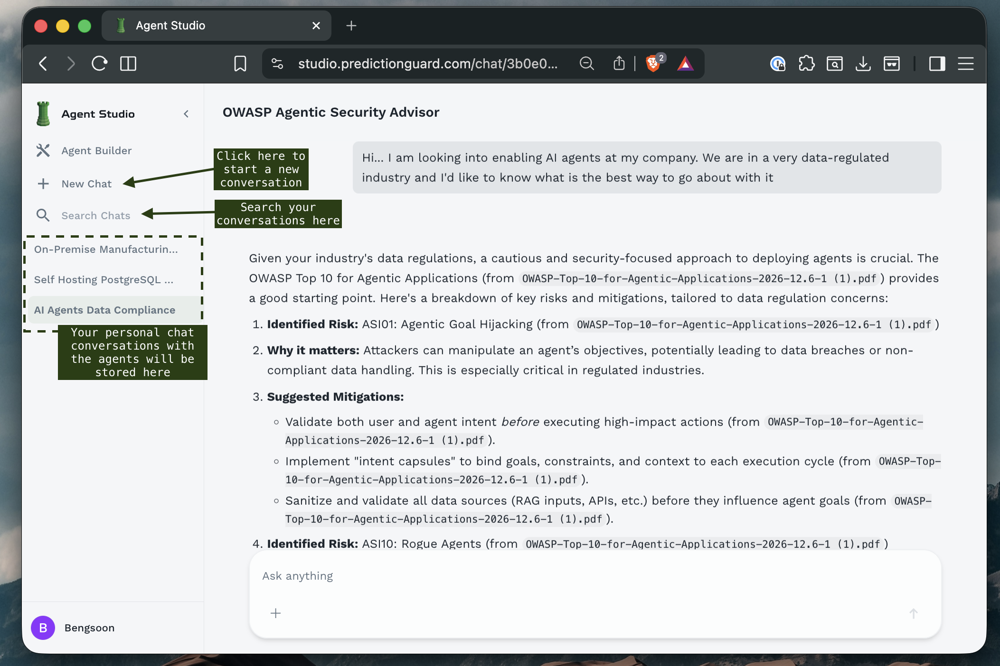
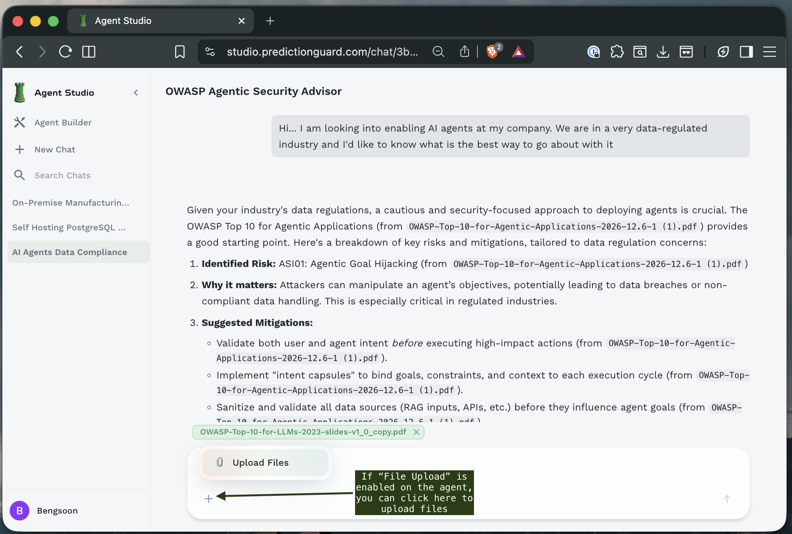
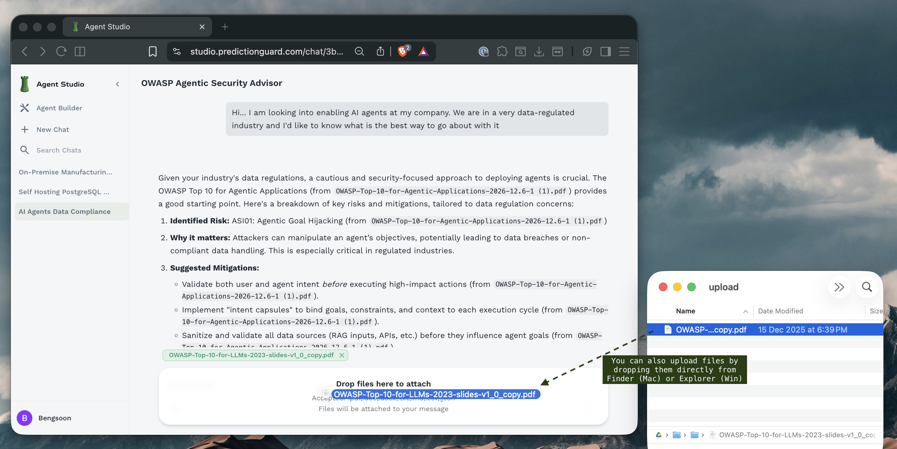

## The Chat Interface

### First Screen: Agent Selection

When you log in, you'll see the main Agent Forge interface with available agents that you have built or shared within your organizations.



## Starting a Conversation

### Selecting an Agent

1. **Click the agent dropdown** in the main chat area
2. **Browse available agents** - both your personal agents and shared agents
3. **Click on an agent** to select it
4. The chat interface will update to show the selected agent's name

### Understanding Agent Cards

In the Agent Builder view, you'll see agents displayed as cards:


Each agent card shows:
- **Agent Name**: Descriptive title
- **Model**: The underlying LLM (e.g., `gpt-oss-120b`, `gemma-2-27b-it`)
- **Description**: Brief explanation of the agent's purpose
- **Capabilities**: Tags indicating special features (e.g., `shared`, `file-uploads`)
- **Action Buttons**: Options to chat, edit, or manage the agent that you have access to

### Beginning Your Chat

Once an agent is selected:



1. **Review the agent information** displayed at the top
2. **Type your message** in the text box at the bottom
3. **Press Enter** or **click the send button** to submit
4. **Wait for the response** - responses may stream in real-time if streaming mode is enabled

## Managing Conversations

### Chat Management Features



The left sidebar provides conversation management tools:

**Navigation Options**:
- **Starred Conversations**: Quick access to important chats
- **Search Functionality**: Find specific conversations by content or date
- **Chat History**: Browse all previous conversations
- **New Chat**: Start fresh conversation threads

**Organizing Chats**:
- **Star important conversations**: Click the star icon to mark key discussions
- **Search by keyword**: Use the search bar to find specific topics
- **Delete old chats**: Remove conversations you no longer need

### Conversation Context

Each chat maintains context throughout the conversation:
- **Previous messages** are remembered within the session
- **File attachments** remain accessible during the conversation
- **Agent configuration** stays consistent throughout the chat

<Callout intent="success">
**Best Practice**: Start a new chat when switching topics to ensure clean context and better responses.
</Callout>

## Uploading Files

Agent Forge supports file uploads to provide context and documentation to agents.

### Upload Methods

#### Method 1: Click to Upload



1. **Click the "Upload Files" button** at the bottom of the chat interface
2. **Browse your files** in the file picker dialog
3. **Select one or multiple files**
4. **Click "Open"** to attach files
5. Files will appear in the chat as attachments

#### Method 2: Drag and Drop



1. **Select files** from your file manager
2. **Drag files** over the chat interface
3. **Drop files** in the designated area
4. Files are automatically uploaded and attached

### Supported File Types

Agent Forge supports various document formats:

- `.txt` - Plain text files
- `.md` - Markdown files
- `.csv` - Comma-separated values
- `.json` - JSON data files
- `.pdf` - PDF documents
- `.docx` or `.doc` - Microsoft Word documents


### Working with Uploaded Files

Once files are uploaded:

**When Asking Questions About Files**:
- Make sure to mention the filename (does not have to be exact) that you have uploaded 
```
"Summarize the key points in "KPI-2025.docx"."
"What are the main key points in the PDF file OWASP presentation? (filename: 04-OWASP_presentation.pdf)"
```

**File Context**:
- Agents can read and analyze uploaded files
- Multiple files can be referenced in a single conversation
- File content is available throughout the chat session

**File Management**:
- **View uploaded files**: See list of attachments in the chat
- **Remove files**: Click the X icon on unwanted attachments
- **Updating files**: Remove the old file and upload a new version

## Best Practices

### Getting Quality Responses

**Be Specific**:
❌ "Tell me about security"
✅ "What are the top 3 security vulnerabilities in REST APIs and how can I prevent them?"

**Provide Context**:
❌ "How do I optimize this?"
✅ "I'm running a Python Flask API serving 10,000 requests/day. How can I optimize database query performance?"

**Use Follow-ups**:
- Build on previous responses
- Ask for clarification
- Request specific examples or formats

### File Upload Tips

**Prepare Files**:
- Use **clear file names** that indicate content
- **Remove sensitive information** before uploading
- **Compress large files** when possible

**Context in Prompts**:
```
"I've uploaded our Q4 financial report (Q4-Fin-Report.csv). Can you identify the top 3 expense categories and suggest optimization opportunities?"
```

## Troubleshooting

### Common Issues

**Agent not responding**:
- Check your internet connection
- Verify the agent is properly configured
- Try refreshing the page
- Contact administrator if issues persist

**File upload fails**:
- Check file size (may exceed limit)
- Verify file format is supported
- Ensure stable internet connection
- Try uploading smaller files

**Slow responses**:
- Model may be processing complex request
- High system load may cause delays
- Streaming mode can improve perceived speed
- Break complex questions into smaller parts

**Context lost**:
- Start a new chat for fresh context
- Avoid extremely long conversations (>20-30 turns)
- Provide necessary context in each message
- Re-upload files if needed in new conversations

## Security Considerations

### Data Privacy

When chatting with agents:
- **PII Detection**: Agents may automatically detect and handle personal information
- **Prompt Injection**: Protection against malicious prompt manipulation
- **Access Logs**: Conversations may be logged for audit purposes
- **Organization Visibility**: Shared agents may be accessible to other users

### Safe Practices

- **Don't share passwords** or API keys in chats
- **Mask sensitive data** when providing examples
- **Review agent permissions** before uploading confidential files
- **Use private agents** for sensitive organizational information

## Next Steps

Now that you know how to chat with agents:

1. **[Build Your Own Agent](/agent-forge/using-agent-forge/building-agents)** - Create specialized agents for your needs
2. **[Set Up Knowledge Bases](/agent-forge/using-agent-forge/knowledge-base)** - Enhance agents with organizational knowledge
3. **[Explore Advanced Features](/agent-forge/using-agent-forge/building-agents#generation-settings)** - Fine-tune agent configurations