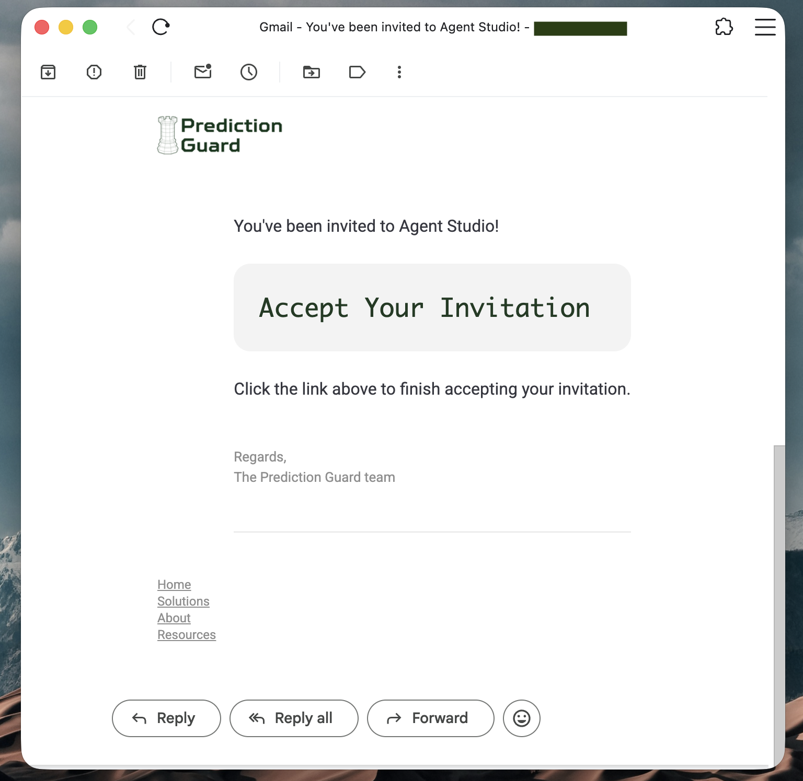
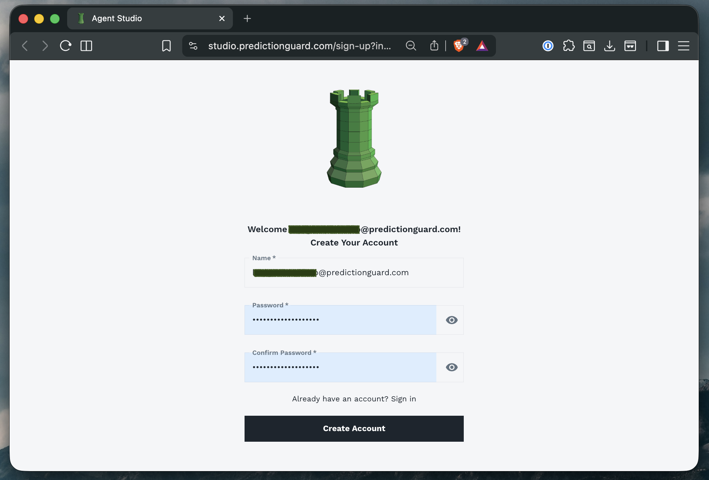
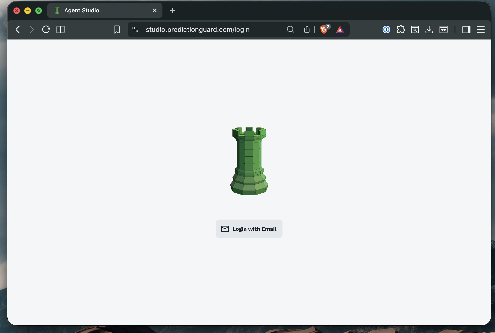
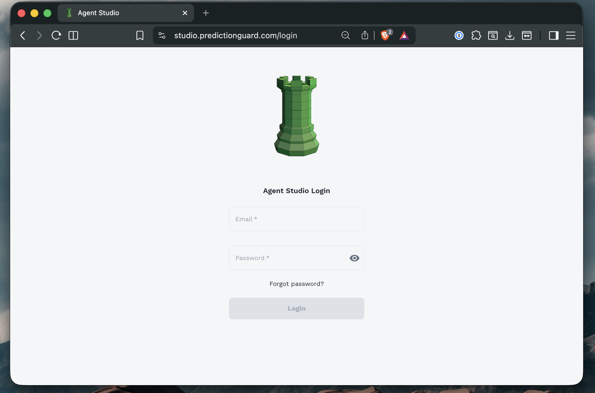
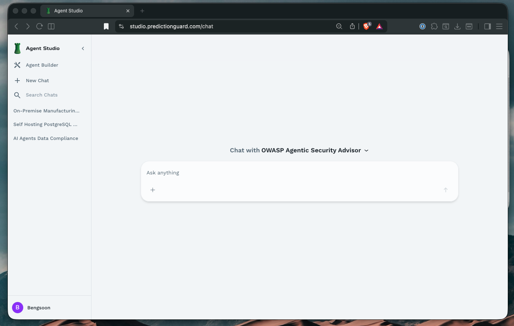

# Getting Started with Agent Forge

This guide walks you through the initial setup process for Agent Forge, from receiving your invitation to logging in and accessing your first agents.

## Prerequisites

Before you begin, ensure:
- Your organization has a Prediction Guard deployment with Agent Forge enabled
- An administrator has access to invite users to Agent Forge
- You have a valid email address for account creation

## Step 1: Receiving Your Invitation

Agent Forge uses an invitation-based system to ensure secure access control.

### Email Invitation

Your organization's administrator will send you an invitation email:

The invitation email contains:
- **From**: Prediction Guard Team
- **Subject**: "You've been invited to Agent Forge!"
- **Content**: Welcome message and acceptance link

### Accepting the Invitation

1. **Check your inbox** for the invitation email
2. **Click "Accept Your Invitation"** link in the email
3. You'll be redirected to the registration page

## Step 2: Creating Your Account

After clicking the invitation link, you'll be directed to the sign-up page.

### Registration Form

Complete the following fields:

1. **Name**: Your full name (will be visible to other users in your organization)
2. **Email**: Pre-filled from your invitation (typically your work email)
3. **Password**: Create a strong password
4. **Confirm Password**: Re-enter your password to confirm

### Completing Registration

1. **Fill in all required fields** (marked with asterisk *)
2. **Click "Create Account"** button
3. Wait for account creation confirmation
4. You'll be automatically redirected to the login page

## Step 3: Logging In

Access Agent Forge through your organization's dedicated URL.

### Login Process

1. **Navigate** to `studio.predictionguard.com` (or your organization's custom domain)
2. **Enter your email address** (the one used during registration)
3. **Enter your password**
4. **Click "Log In"** or press Enter

### First-Time Login

On your first login, you may be prompted to:
- Complete your profile information
- Accept terms of service
- Set up additional security preferences

## Step 4: Password Management

### Forgot Password

If you forget your password:

1. **Click "Forgot Password?"** on the login page
2. **Enter your email address**
3. **Check your inbox** for password reset instructions
4. **Click the reset link** in the email
5. **Create a new password**
6. **Confirm** your new password
7. **Log in** with your new credentials

## Post-Login: Your First Session

After successfully logging in, you'll land on the Agent Forge home screen.

### What You'll See

- **Sidebar Navigation**: Access to Agent Builder, chats, and knowledge bases
- **Shared Agents**: Agents shared by your organization
- **Your Agents**: Agents you've created (empty initially)
- **Chat Interface**: Ready to start conversations

### Exploring the Interface

The Agent Forge interface consists of several key areas:

**Left Sidebar**:
- **Agent Builder**: Create and manage your agents
- **New Chat**: Start a conversation with an agent
- **Search Chats**: Find previous conversations

**Main Area**:
- **Agent Selection**: Choose which agent to chat with
- **Chat Interface**: Conversation area
- **Agent Cards**: Browse available agents

## Troubleshooting

### Common Issues

**Issue: Invitation link has expired**
- **Solution**: Request a new invitation from your administrator.

**Issue: Can't create account**
- **Solution**: Verify your email is correct and matches the invitation. Check password requirements.

**Issue: Login fails with correct credentials**
- **Solution**: Try resetting your password. Ensure Caps Lock is off. Clear browser cache and cookies.

**Issue: Not seeing any agents**
- **Solution**: Your organization may not have created shared agents yet. Contact your admin or create your own agent.

## Next Steps

Now that you're logged in:

1. **[Explore the Chat Interface](/agent-forge/using-agent-forge/chatting-with-agents)** - Learn how to interact with agents
2. **[Build Your First Agent](/agent-forge/using-agent-forge/building-agents)** - Create a custom agent
3. **[Create a Knowledge Base](/agent-forge/using-agent-forge/knowledge-base)** - Add documents to enhance agent responses

---

**Ready to start chatting?** Continue to [Chatting with Agents](/agent-forge/using-agent-forge/chatting-with-agents) to learn how to interact with AI agents.