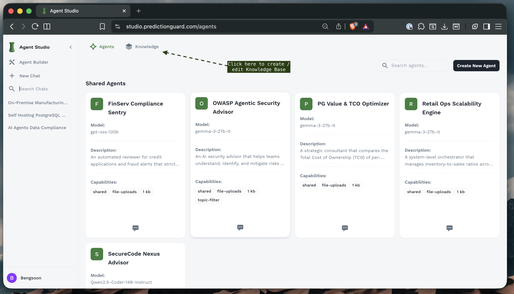
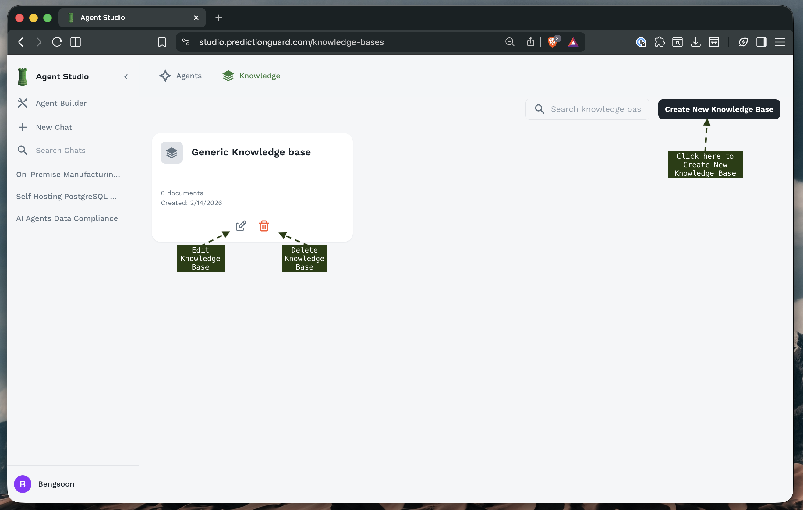
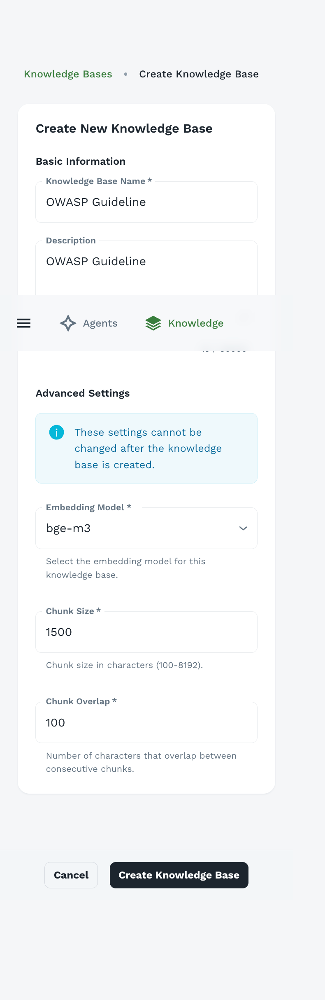
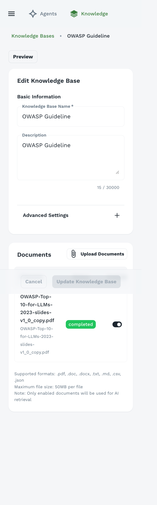
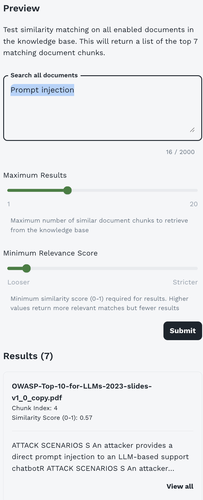

## What is a Knowledge Base?

A knowledge base is a collection of documents that agents can search and reference when answering questions. When a user asks a question:

1. **Semantic Search**: The system searches the knowledge base for relevant content
2. **Retrieval**: Top matching document chunks are retrieved
3. **Context Injection**: Relevant content is added to the agent's context
4. **Response Generation**: Agent generates response using both its training and the retrieved knowledge

### Benefits of Knowledge Bases

**Accuracy**: Agents provide information based on your organization's actual documents and policies

**Currency**: Update knowledge by adding new documents - no need to retrain models

**Source Attribution**: Agents can cite specific documents or sources

**Consistency**: All agents using the same knowledge base provide consistent information

**Specialization**: Create domain-specific knowledge bases for different agent types

## Accessing Knowledge Base Management

Navigate to the Knowledge section from the left sidebar or top navigation.



The Knowledge Base interface provides:
- **Tabs**: Switch between Agents and Knowledge sections
- **Knowledge Base List**: View all your organization's knowledge bases
- **Create Button**: Create new knowledge bases
- **Search**: Find specific knowledge bases

## Knowledge Base Overview



The main Knowledge Base screen displays:

**Knowledge Base Cards**: Each showing:
- **Name**: Descriptive title
- **Document Count**: Number of documents in the KB
- **Creation Date**: When the KB was created
- **Edit/Delete Options**: Manage the knowledge base
- **Document Thumbnails**: Preview of included files

**Example Knowledge Bases**:
- **Generic Knowledge Base**: General organizational information
- **On-Premise Manufacturing Predictive**: Manufacturing-specific knowledge
- **Self Hosting PostgreSQL**: Database documentation
- **AI Agents Data Compliance**: Compliance and regulatory documents

## Creating a Knowledge Base

### Step 1: Initiate Creation



1. **Click "Create New Knowledge Base"** button in the top-right corner
2. The knowledge base creation form appears

### Step 2: Basic Information

**Knowledge Base Name** (Required)
- Descriptive, clear name indicating the KB's content
- Examples: "OWASP Guidelines", "Product Documentation", "Company Policies"

**Description**
- Explain what documents are included
- Indicate which agents should use this KB
- Note any specific focus areas or limitations

**Example**:
```
OWASP Guideline

This knowledge base contains comprehensive OWASP security
guidelines and best practices for secure application development.
Use with security-focused agents for vulnerability assessment
and secure coding recommendations.
```

### Step 3: Advanced Settings

<Callout intent="warning">
**Important**: These settings **cannot be changed** after the knowledge base is created. Plan carefully before proceeding.
</Callout>

#### Embedding Model

**Purpose**: The model used to generate vector embeddings for semantic search

**Available Models**:
- **bge-m3**: Multilingual, high-quality embeddings (recommended)
- **bridgetower**: Multimodal embeddings (text + images)
- Other models based on your deployment

**Choosing an Embedding Model**:

| Model | Best For | Languages | Notes |
|-------|----------|-----------|-------|
| bge-m3 | General purpose, multilingual | 100+ languages | Excellent balance |
| bridgetower | Documents with images | English | Multimodal support |

**Recommendation**: Use **bge-m3** for most use cases unless you have specific requirements.

<Callout intent="info">
**Why It Matters**: The embedding model must remain consistent for a knowledge base. Changing it would require regenerating all embeddings, which is why it's locked after creation.
</Callout>

#### Chunk Size

**Range**: 100-8192 characters

**Default**: 1500 characters

**Purpose**: Size of text segments for indexing and retrieval

**How It Works**:
- Documents are split into chunks of approximately this size
- Each chunk is embedded separately
- During search, individual chunks are matched and retrieved
- Multiple chunks can be retrieved from the same document

**Choosing Chunk Size**:

| Size | Use Case | Advantages | Disadvantages |
|------|----------|------------|---------------|
| 500-1000 | Short Q&A, definitions | Precise matching | May miss context |
| 1000-2000 | General purpose (recommended) | Good balance | Standard |
| 2000-4000 | Long-form content | More context per chunk | Less precise |
| 4000-8192 | Technical docs, code | Maximum context | May include irrelevant info |

**Best Practices**:
```
FAQ documents: 800-1200 characters
Technical manuals: 1500-2000 characters
Legal documents: 2000-3000 characters
Code repositories: 1500-2500 characters
```

**Example**: With chunk size 1500:
- 3000-word document = ~6-8 chunks
- Each chunk contains 200-250 words
- Chunks overlap to maintain context

#### Chunk Overlap

**Range**: 0-500+ characters

**Default**: 100 characters

**Purpose**: Number of characters that overlap between consecutive chunks

**Why Overlap Matters**:
- Prevents breaking related information across chunks
- Maintains context at chunk boundaries
- Improves retrieval quality

**Visual Example**:
```
Chunk Size: 1500, Overlap: 100

Document: [------------------------3000 characters------------------------]

Chunk 1: [-------1500-------]
                        [100]  <- Overlap
Chunk 2:              [-------1500-------]
                                    [100]  <- Overlap
Chunk 3:                          [-------1500-------]
```

**Recommended Overlap**:
```
Chunk 500: Overlap 50 (10%)
Chunk 1500: Overlap 100-150 (7-10%)
Chunk 3000: Overlap 200-300 (7-10%)
```

**Higher Overlap**:
- ✅ Better context preservation
- ✅ Fewer missed connections
- ❌ More storage required
- ❌ Potential redundancy

**Lower Overlap**:
- ✅ More efficient storage
- ✅ Faster processing
- ❌ May break related content
- ❌ Context gaps at boundaries

<Callout intent="success">
**Tip**: For most use cases, set overlap to 7-10% of chunk size. This provides good context preservation without excessive redundancy.
</Callout>

### Step 4: Create the Knowledge Base

1. **Review all settings** carefully (Advanced Settings are permanent)
2. **Click "Create Knowledge Base"**
3. Empty knowledge base is created
4. You'll be directed to the document upload interface

## Uploading Documents

After creating a knowledge base, you can add documents.



### Supported File Formats

Agent Forge supports a wide range of document formats:

**Document Formats**:
- `.pdf` - PDF documents
- `.doc` - Microsoft Word (legacy)
- `.docx` - Microsoft Word
- `.txt` - Plain text files
- `.md` - Markdown files

**Structured Data**:
- `.csv` - Comma-separated values
- `.json` - JSON data files

**Other Formats** (check your deployment):
- `.pptx` - PowerPoint presentations
- `.xlsx` - Excel spreadsheets
- `.html` - Web pages
- `.xml` - XML documents

### Document Management

Once uploaded, each document shows:
- **Filename**: Original document name
- **Status**: Processing status badge
- **Toggle**: Enable/disable document
- **Delete**: Remove document from knowledge base

**Enable/Disable Documents**:
- Use the toggle switch to enable or disable documents
- **Disabled documents** are not searched
- Useful for temporarily excluding documents without deleting

<Callout intent="info">
**Note**: Only **enabled** documents will be used for AI retrieval. Disable documents you want to keep but not search.
</Callout>

## Testing Semantic Search

One of the most powerful features of Agent Forge is the ability to test your knowledge base's semantic search directly - before attaching it to any agents. This helps you verify that your documents are properly indexed and that the search is returning relevant results.

### Accessing the Preview Feature

To test semantic search on a knowledge base:

1. **Navigate to the Knowledge section** from the sidebar
2. **Click on a knowledge base** card to open it
3. **Click the "Preview" button** at the top of the knowledge base detail page
4. The semantic search testing interface will appear



### Understanding the Preview Interface

The Preview interface provides a complete testing environment for your knowledge base:

**Header Description**:
```
"Test similarity matching on all enabled documents in the knowledge base.
This will return a list of the top 7 matching document chunks."
```

This feature searches across **all enabled documents** in your knowledge base using the same semantic search technology that agents use.

### Search Components

#### Search Query Box

**Purpose**: Enter your test query to search the knowledge base

**Character Limit**: 2000 characters

**What to Test**:
- Natural language questions
- Keywords and phrases
- Specific concepts or terms
- Edge cases and variations

<Callout intent="success">
**Tip**: Use the same types of questions your users will ask agents. This gives you realistic preview of search performance.
</Callout>

#### Maximum Results Slider

**Range**: 1 to 20 chunks

**Purpose**: Control how many document chunks are retrieved

**Default**: Typically set to 7 (as shown in interface)

**How to Use**:
- **Lower values (1-5)**: Test if top results are highly relevant
- **Medium values (5-10)**: Standard testing (balanced)
- **Higher values (10-20)**: See breadth of relevant content

**What to Look For**:
- Are the top results most relevant?
- At what point do results become less relevant?
- Do you have enough relevant chunks for complex queries?

#### Minimum Relevance Score Slider

**Range**: Looser (0.0) to Stricter (1.0)

**Purpose**: Filter results by similarity score threshold

**How It Works**:
- Each result has a similarity score from 0 to 1
- 0 = No similarity, 1 = Perfect match
- Only results above the threshold are returned

**Slider Positions**:

| Position | Score Range | Use Case |
|----------|-------------|----------|
| Looser (left) | 0.3-0.5 | Broad, exploratory searches |
| Middle | 0.5-0.7 | Balanced (recommended for testing) |
| Stricter (right) | 0.7-1.0 | High precision requirements |

**Testing Strategy**:
1. Start with **middle position**
2. Run your test query
3. If too many irrelevant results: **Move right** (stricter)
4. If too few results: **Move left** (looser)
5. Find the sweet spot for your content

### Understanding Search Results

After clicking **Submit**, you'll see results displayed with detailed information:

#### Results Header

```
Results (7)
```

Shows the total number of chunks returned matching your criteria.

#### Individual Result Cards

Each result displays comprehensive information:

**Document Name**:
```
OWASP-Top-10-for-LLMs-2023-slides-v1_0_copy.pdf
```
The source document containing this chunk.

**Chunk Index**:
```
Chunk Index: 4
```
The position of this chunk within the document (0-indexed). Useful for understanding document structure.

**Similarity Score**:
```
Similarity Score (0-1): 0.57
```
How closely this chunk matches your query:
- **0.8-1.0**: Highly relevant, near-exact match
- **0.6-0.8**: Good relevance, strong match
- **0.4-0.6**: Moderate relevance, partial match
- **0.2-0.4**: Weak relevance, tangential
- **0.0-0.2**: Very weak, likely irrelevant

**Chunk Preview**:
```
ATTACK SCENARIOS S An attacker provides a
direct prompt injection to an LLM-based support
chatbot ATTACK SCENARIOS S An attacker...
```
First ~150-200 characters of the chunk content. Lets you verify relevance at a glance.

**View All Link**:
Click to see the complete chunk text (up to your configured chunk size).

### Interpreting Results

#### What Good Results Look Like

**High Relevance Scores**:
- Top 3-5 results should have scores **above 0.6**
- At least one result should be **above 0.7** for specific queries

**Appropriate Content**:
- Chunks directly address the query
- Information is accurate and complete
- Context is preserved (no mid-sentence cuts)

**Good Distribution**:
- Results come from relevant documents
- Multiple perspectives if applicable
- Logical ordering by relevance

**Example Good Result**:
```
Query: "prompt injection attacks"

Result #1:
Document: OWASP-Top-10-for-LLMs-2023.pdf
Chunk Index: 12
Similarity Score: 0.87
Preview: "Prompt injection attacks occur when an attacker
manipulates the input to an LLM in order to override its
original instructions..."
✅ Highly relevant, directly addresses query
```

#### Warning Signs

**Low Relevance Scores**:
```
All results below 0.5 = Potential issues:
- Documents don't contain relevant information
- Chunk size may be too large/small
- Query phrasing doesn't match document language
```

**Irrelevant Content**:
```
Query: "authentication best practices"
Result: Content about "database optimization"
Similarity Score: 0.45

❌ Not relevant - may indicate:
- Missing content in knowledge base
- Poor document organization
- Need for additional documents
```

**Broken Context**:
```
Preview: "...the process requires that before starting
you must ensure..."

❌ Mid-sentence start, missing context
- May need increased chunk overlap
- Document structure issues
```

### Testing Strategies

#### 1. Comprehensive Coverage Testing

**Goal**: Verify knowledge base covers intended topics

**Process**:
```
1. List 10-15 key topics your KB should cover
2. Create test queries for each topic
3. Run searches and check results
4. Identify gaps in coverage
5. Add missing documents
```

**Example Test Plan**:
```
Knowledge Base: "Security Best Practices"

Test Queries:
✓ "SQL injection prevention" → Good results (0.78)
✓ "XSS mitigation" → Good results (0.82)
✗ "CSRF protection" → No relevant results
  → Action: Add CSRF documentation
✓ "Authentication methods" → Good results (0.71)
✗ "Session management" → Low scores (0.43)
  → Action: Improve existing docs or add content
```

#### 2. Relevance Threshold Testing

**Goal**: Find optimal minimum relevance score for your KB

**Process**:
```
1. Choose 5 representative test queries
2. Start with score at "Looser" (left)
3. Run each query, note result quality
4. Move slider right incrementally
5. Find sweet spot where:
   - Good results are included
   - Irrelevant results are filtered out
```

**Documentation**:
```
Query: "GDPR compliance requirements"

Looser (0.3): 15 results, 8 relevant, 7 irrelevant
Medium (0.5): 9 results, 8 relevant, 1 irrelevant ✓
Stricter (0.7): 4 results, 4 relevant, 0 irrelevant ✓

Recommendation: Set agent minimum score to 0.5-0.7
```

#### 3. Chunk Size Validation

**Goal**: Verify chunk size settings are appropriate

**Process**:
```
1. Run several test queries
2. Click "View all" on results
3. Check if chunks are:
   - Complete thoughts/paragraphs
   - Not cut off mid-sentence
   - Contain sufficient context
   - Not overly long with irrelevant info
```

**If chunks are problematic**:
- **Too small** (broken context): Create new KB with larger chunk size
- **Too large** (diluted relevance): Create new KB with smaller chunk size
- **Poor boundaries**: Increase chunk overlap in new KB

<Callout intent="warning">
**Remember**: Chunk size and overlap cannot be changed after KB creation. Create a new KB if needed.
</Callout>

#### 4. Query Variation Testing

**Goal**: Ensure KB works with different phrasings

**Process**:
```
Test the same concept with different queries:

Query 1: "How do I prevent SQL injection?"
Query 2: "SQL injection protection methods"
Query 3: "Defending against SQL attacks"
Query 4: "Database input sanitization"

All should return similar, relevant results.
If not → May need more diverse documents or better document coverage
```

### Best Practices for Testing

**Before Attaching to Agents**:
1. ✅ Test with 20-30 representative queries
2. ✅ Verify top results have scores above 0.6
3. ✅ Check that chunks contain complete, useful information
4. ✅ Confirm coverage of all intended topics
5. ✅ Test edge cases and unexpected queries
6. ✅ Document optimal relevance threshold

**Regular Testing**:
- **After adding documents**: Test that new content is retrievable
- **Monthly**: Run standard test queries to ensure consistency
- **After changes**: Verify updates haven't broken existing searches

**Document Your Findings**:
```
Knowledge Base: Security Guidelines
Tested: 2024-02-14
Optimal Settings:
  - Minimum Relevance Score: 0.55-0.65
  - Recommended Max Results: 8-10
Coverage:
  ✓ OWASP Top 10
  ✓ Authentication
  ✓ Encryption
  ✗ API Security (needs addition)
Action Items:
  - Add API security documentation
  - Update outdated sections on TLS
```

### Troubleshooting Search Issues

**Issue: No results returned**
- **Check**: Are documents enabled?
- **Check**: Is minimum relevance score too strict?
- **Try**: Move slider to "Looser"
- **Try**: Rephrase query with simpler terms
- **Solution**: May need to add content on this topic

**Issue: Low relevance scores across the board**
- **Check**: Do documents actually cover this topic?
- **Check**: Is query phrasing very different from document language?
- **Try**: Use terminology from your documents
- **Solution**: May need to add or improve documents

**Issue: Too many irrelevant results**
- **Check**: Is minimum relevance score too loose?
- **Try**: Move slider to "Stricter"
- **Try**: Be more specific in query
- **Solution**: Consider removing off-topic documents

**Issue: Results are out of order by relevance**
- **Check**: Scores are very close (e.g., 0.67 vs 0.66)
- **This is normal**: Slight variations in scoring
- **Solution**: If top results are relevant, this is fine

### Using Test Results to Configure Agents

After thorough testing, use your findings to configure agents:

**In Agent Builder** → **Resources & Knowledge** → **Customize Search Settings**:

1. **Minimum Relevance Score**: Set based on your testing
   ```
   If testing showed 0.55 works well → Set agent to 0.5-0.6
   ```

2. **Maximum Results**: Based on how many chunks are typically relevant
   ```
   If top 5-8 results usually relevant → Set to 8-10
   ```

3. **Maximum Context Size**: Based on chunk sizes and result counts
   ```
   10 results × 1500 chars/chunk = 15,000 minimum context size
   ```

### Example Testing Workflow

**Complete Example**: Testing a new Security KB

```
Step 1: Initial Upload
- Uploaded 15 security documents
- All processing completed

Step 2: Coverage Testing
Query: "SQL injection" → 0.82 ✓
Query: "XSS prevention" → 0.79 ✓
Query: "CSRF attacks" → 0.34 ✗ (needs content)
Query: "Authentication" → 0.71 ✓
Query: "Session security" → 0.48 ⚠️ (weak)

Step 3: Threshold Testing
Tested at 0.4, 0.5, 0.6, 0.7
Optimal: 0.55 (good balance)

Step 4: Chunk Quality Check
Viewed full chunks - mostly complete
Some cut mid-paragraph (acceptable)

Step 5: Recommendations
- Add CSRF documentation (missing)
- Enhance session security content (weak)
- Set agent minimum relevance: 0.55
- Set agent max results: 8

Step 6: Actions Taken
- Added CSRF guide document
- Re-tested: now 0.73 ✓
- Configured security agent with findings
- Documented for team
```

### Next Steps After Testing

Once you're satisfied with test results:

1. **[Configure Agents](/agent-forge/using-agent-forge/building-agents#resources--knowledge)** - Attach KB to agents with optimal settings
2. **Monitor Performance** - Track agent response quality
3. **Iterate** - Continuously improve based on user feedback
4. **Document** - Keep notes on what works best

<Callout intent="success">
**Pro Tip**: Bookmark high-performing test queries and run them periodically to ensure consistent KB quality over time.
</Callout>

## Best Practices for Knowledge Bases

### Document Preparation

**Before Uploading**:

1. **Clean Documents**:
   - Remove unnecessary headers/footers
   - Fix formatting issues
   - Remove duplicate content
   - Ensure text is selectable (not scanned images without OCR)

2. **Organize Content**:
   - Use clear headings and structure
   - Break long documents into logical sections
   - Include table of contents for long docs
   - Use consistent formatting

3. **Add Metadata**:
   - Include document titles
   - Add creation/update dates
   - Note document version if applicable
   - Include author or source information

**Document Quality**:
```
✅ Well-structured PDFs with clear headings
✅ Updated, current information
✅ Accurate, fact-checked content
✅ Clear, professional writing

❌ Scanned images without text layer
❌ Outdated, deprecated information
❌ Duplicate or redundant content
❌ Poor quality or corrupted files
```

### Organizing Knowledge Bases

**Strategy 1: By Domain**
- "Security Knowledge Base" - All security-related docs
- "Compliance Knowledge Base" - Regulatory and compliance docs
- "Product Documentation" - Product guides and manuals

**Strategy 2: By Audience**
- "Customer Facing KB" - Public information
- "Internal Operations KB" - Internal procedures
- "Technical Team KB" - Developer documentation

**Strategy 3: By Update Frequency**
- "Static Policies KB" - Rarely changing policies
- "Product Updates KB" - Frequently updated features
- "Current Events KB" - Time-sensitive information

### Maintenance

**Regular Reviews**:
- **Audit content** quarterly
- **Remove outdated** documents
- **Update changed** information
- **Add new** relevant documents

**Quality Checks**:
- Test knowledge base with sample queries
- Verify agents are retrieving correct information
- Check for gaps in coverage
- Monitor user feedback on agent responses

## Editing Knowledge Bases

To edit an existing knowledge base:

1. **Navigate to Knowledge section**
2. **Click on the knowledge base** card
3. **Edit Basic Information**:
   - Update name
   - Modify description
4. **Manage Documents**:
   - Upload additional documents
   - Enable/disable existing documents
   - Delete unwanted documents
5. **Click "Update Knowledge Base"**

<Callout intent="warning">
**Remember**: Advanced Settings (embedding model, chunk size, chunk overlap) **cannot be changed** after creation.
</Callout>

## Attaching Knowledge Bases to Agents

Once created, attach knowledge bases to agents:

1. **Go to Agent Builder**
2. **Create or edit an agent**
3. **Navigate to "Resources & Knowledge" section**
4. **Select "Knowledge Bases"** dropdown
5. **Choose one or more knowledge bases**
6. **Configure search settings** (optional)
7. **Save agent**

See [Building Agents - Resources & Knowledge](/agent-forge/using-agent-forge/building-agents#resources--knowledge) for detailed instructions.

## Testing Knowledge Bases

### Verification Steps

After uploading documents:

1. **Create a test agent** with the knowledge base attached
2. **Ask questions** you know are answered in the documents
3. **Verify responses** cite correct information
4. **Test edge cases** - questions with no answer in KB
5. **Check relevance** - are retrieved chunks actually relevant?

### Sample Test Queries

**Direct Fact Retrieval**:
```
"What is the maximum file size allowed?"
Expected: Agent retrieves and cites exact limit from docs
```

**Conceptual Questions**:
```
"Explain the process for creating a new agent"
Expected: Agent synthesizes information from relevant sections
```

**Multi-Document Queries**:
```
"What are the differences between security settings and access control?"
Expected: Agent combines information from multiple docs
```

**Not in Knowledge Base**:
```
"What's the weather today?"
Expected: Agent acknowledges this isn't in its knowledge base
```

## Troubleshooting

### Common Issues

**Issue: Agent not using knowledge base**
- **Solution**:
  - Verify KB is attached to agent
  - Check documents are enabled
  - Lower minimum relevance score
  - Increase maximum results

**Issue: Irrelevant results retrieved**
- **Solution**:
  - Increase minimum relevance score
  - Reduce chunk size for more precise matching
  - Review document quality
  - Remove off-topic documents

**Issue: Document upload fails**
- **Solution**:
  - Check file size (under 50MB)
  - Verify file format is supported
  - Ensure file isn't corrupted
  - Try uploading again

**Issue: Processing takes very long**
- **Solution**:
  - Large files take longer to process
  - Complex PDFs may need more time
  - Check status periodically
  - Contact admin if stuck for hours

**Issue: Chunks don't contain complete information**
- **Solution**:
  - Increase chunk size
  - Increase chunk overlap
  - Restructure source documents for better segmentation
  - Note: Can't change existing KB - create new one

### Performance Optimization

**Faster Search**:
- Use focused knowledge bases (fewer documents)
- Remove redundant documents
- Optimize chunk size for your use case
- Set appropriate maximum results limit

**Better Results**:
- Higher quality source documents
- Appropriate chunk size for content type
- Good chunk overlap (7-10%)
- Regular content updates

## Advanced Topics

### Semantic Search Explained

Knowledge bases use **semantic search**, not keyword search:

**Keyword Search** (Traditional):
```
Query: "How do I reset my password?"
Matches: Documents containing words "reset" and "password"
```

**Semantic Search** (Agent Forge):
```
Query: "How do I reset my password?"
Matches: Documents about:
- Password recovery
- Account access restoration
- Credential reset procedures
Even if they don't use exact words "reset password"
```

### Embedding Models

Embeddings convert text into numerical vectors that capture meaning:

```
"The cat sat on the mat" → [0.234, -0.456, 0.789, ...]
"A feline rested on the rug" → [0.221, -0.442, 0.801, ...]
```

Similar meanings produce similar vectors, enabling semantic search.

### Vector Databases

Knowledge bases use vector databases (e.g., FAISS, Pinecone, Milvus) to:
- Store embeddings efficiently
- Perform fast similarity search
- Scale to millions of documents
- Enable real-time retrieval

## Security Considerations

### Sensitive Information

**Before uploading**:
- Review documents for sensitive data
- Redact confidential information
- Consider access control implications
- Follow your organization's data policies

**Remember**:
- Knowledge base content may be visible to all agents using it
- Agents with PII detection can mask sensitive data, but prevention is better
- Audit who has access to agents using sensitive KBs

### Access Control

Currently, knowledge bases are organization-wide resources:
- Any agent creator can attach any KB
- Users chatting with agents see information from attached KBs
- Plan knowledge base scope accordingly

**Best Practices**:
- Create separate KBs for different sensitivity levels
- Use clear naming to indicate confidentiality
- Document which agents should use which KBs
- Regular access audits

## Next Steps

Now that you understand knowledge bases:

1. **[Build Agents](/agent-forge/using-agent-forge/building-agents)** - Create agents that use your knowledge bases
2. **[Chat with Agents](/agent-forge/using-agent-forge/chatting-with-agents)** - Test agents with knowledge base integration
3. **Iterate and Improve** - Refine knowledge bases based on agent performance