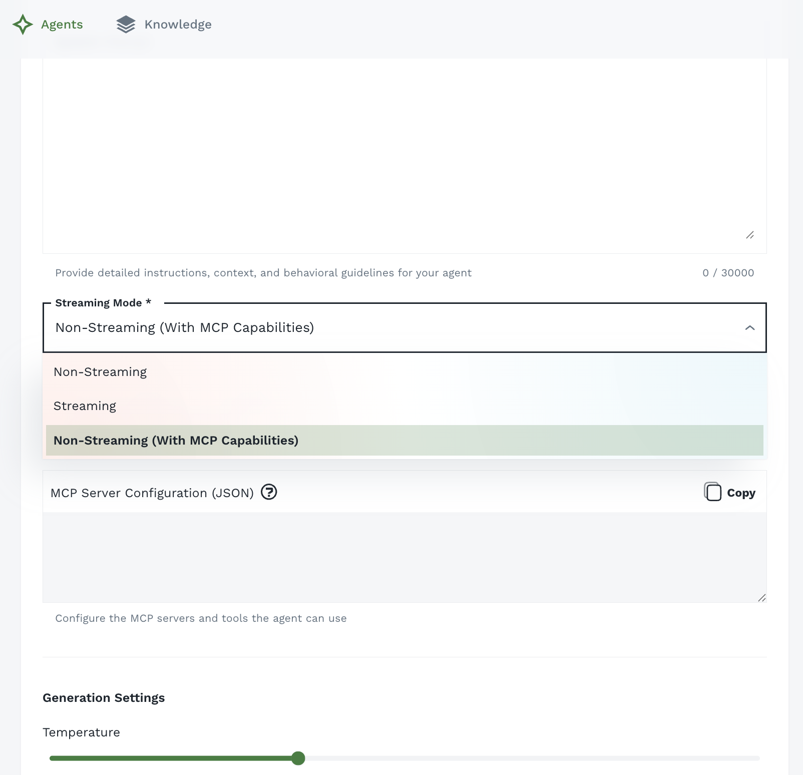
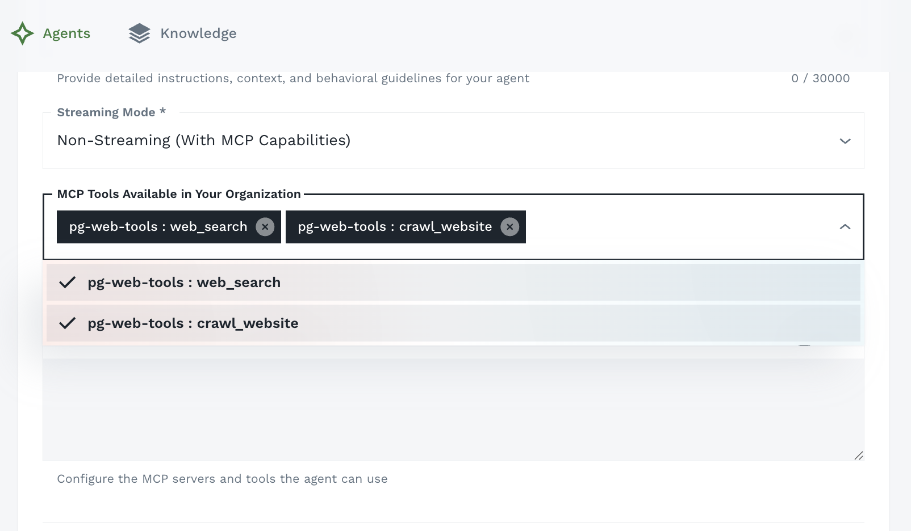
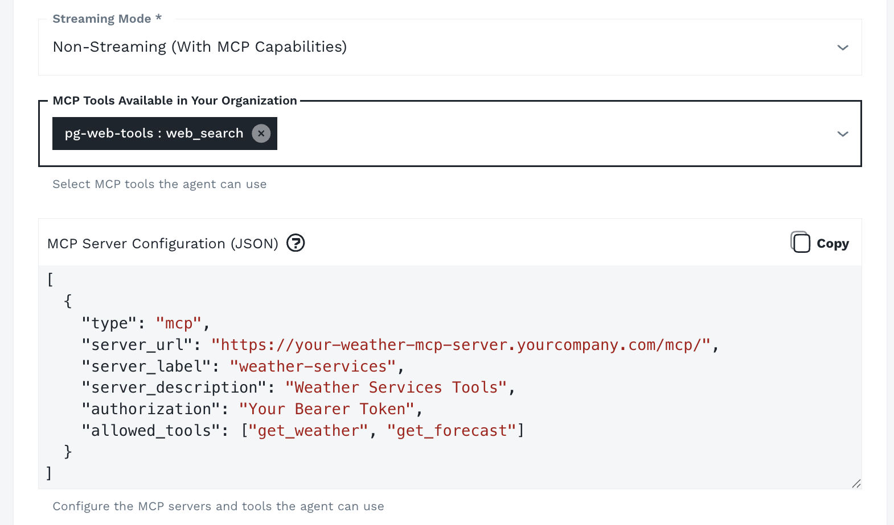

## What is MCP?

MCP (Model Context Protocol) is a standardized protocol for connecting AI models to external capabilities through **MCP servers**. Each MCP server exposes a set of tools that the agent can invoke during a conversation.

**Examples of what MCP enables**:
- Query a live database or data warehouse
- Retrieve real-time information from external APIs
- Execute code or automation scripts
- Read from and write to organizational systems (CRMs, ticketing, file stores)
- Interact with third-party services and integrations

## MCP Levels in Agent Forge

Agent Forge supports MCP at two levels:

| Level | Configured By | Available To |
|-------|--------------|--------------|
| **Organization-level** |  Admin via Unified CX (coming soon!) | All agents in the organization |
| **Agent-level** | Agent Builder and above | That specific agent only |

This layered approach lets administrators centrally manage shared infrastructure while allowing individual agent builders to extend with specialized tools.

## Configuring MCP in the Agent Builder

MCP is configured during agent creation or editing, within the **Agent Builder**.

### Step 1: Enable "Non-Streaming (With MCP Capabilities)" Mode



The MCP support requires **Non-Streaming (With MCP Capabilities)** mode to be enabled.

### Step 2: Select an Organization-Level MCP Server (If Available)



If your organization's administrator has pre-configured MCP servers, they will appear in the **MCP Tools Available in Your Organization** section of the Agent Builder. These are shared, centrally-managed servers available to all agent builders in your organization.

<Callout intent="info">
**Tip**: Organization-level MCP servers are ideal for unified governance and shared infrastructure — internal databases, company APIs, and standard integrations that multiple agents can access.
</Callout>

### Step 3: Add a Custom MCP Server (Agent-Level)



In addition to organization-level servers, you can connect your agent to a **custom MCP server** specific to your agent's needs.

**To add a custom MCP server**:

1. In the **MCP Server Configuration (JSON)** field, enter your server config as a JSON array
2. Each entry in the array defines one MCP server — add multiple objects to connect multiple servers
3. Click **Save** to attach the configuration to your agent

**Configuration format**:

```json
[
  {
    "type": "mcp",
    "server_url": "https://your-mcp-server.yourcompany.com/mcp/",
    "server_label": "your-server-label",
    "server_description": "Description of what this MCP server provides",
    "authorization": "Your Bearer Token",
    "allowed_tools": ["tool_name_1", "tool_name_2"]
  }
]
```

| Field | Description |
|-------|-------------|
| `type` | Always `"mcp"` |
| `server_url` | The full URL of your MCP server endpoint |
| `server_label` | A short identifier for the server (no spaces) |
| `server_description` | Human-readable description of the server's capabilities |
| `authorization` | Bearer token or other auth credential for the server |
| `allowed_tools` | List of specific tool names to expose to the agent |

## How Agents Use MCP Tools

Once MCP servers are configured, the agent automatically has access to the tools exposed by those servers. During a conversation:

1. **User sends a message** requiring external data or action
2. **Agent determines** which MCP tool(s) to invoke
3. **MCP tool executes** against the connected server
4. **Results are returned** to the agent
5. **Agent incorporates results** into its streamed response

This all happens transparently — users see a natural conversational response that incorporates live data.

## Use Cases

### Data Retrieval
Connect agents to internal databases, data warehouses, or BI tools so they can query live figures, metrics, and reports on demand.

### System Integration
Enable agents to interact with ticketing systems, CRMs, or internal tools — looking up records, creating entries, or updating statuses.

### Live API Access
Give agents access to external APIs (weather, financial data, inventory) so responses reflect current real-world state, not just training knowledge.

### Code Execution
Attach MCP servers that execute code or scripts, enabling agents to perform calculations, data transformations, or automation tasks.

## Best Practices

**Name Servers Descriptively**: When adding custom MCP servers, use clear names that indicate what system or capability they represent (e.g., "Inventory DB", "Jira API", "Analytics Platform").

**Test After Configuration**: After saving your agent with MCP configured, start a test conversation and trigger a tool call to verify the MCP connection is working correctly.

**Limit Tool Scope**: Configure MCP servers to expose only the tools your agent actually needs. A focused set of tools reduces confusion and improves agent decision-making.

## Next Steps

- [Building Agents](/agent-forge/using-agent-forge/building-agents) - Full guide to agent configuration
- [Knowledge Base](/agent-forge/using-agent-forge/knowledge-base) - Add RAG-based organizational knowledge alongside MCP tools