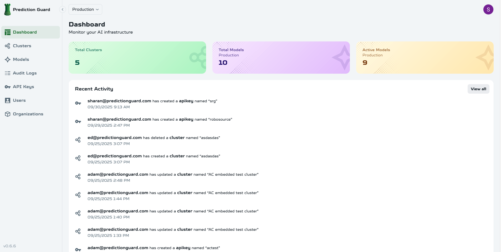

# Admin Panel

The Prediction Guard admin panel is your central command center for managing your entire Prediction Guard platform. From here, you can create and manage multiple clusters, deploy any open model, configure security settings, and monitor all activity across your infrastructure.

## Accessing the Admin Panel

Once your Prediction Guard instance is deployed, you can access the admin panel at:

```
https://admin.predictionguard.com
```

The admin panel is centrally managed by Prediction Guard, providing you with access to manage your clusters and deployments.

### Initial Setup

1. **Login** with your admin credentials
2. **Configure basic settings** (organization name, timezone, etc.)
3. **Set up your first API key** for testing
4. **Deploy your first model** from the model library

## Key Features

### Dashboard


The dashboard provides a comprehensive overview of your Prediction Guard platform:
- **Multi-cluster overview** with health status across all clusters
- **Real-time usage statistics** and performance metrics
- **Security alerts** and system notifications
- **Quick actions** for common administrative tasks
- **Resource utilization** across your infrastructure

### Model Management
- **Browse available models** from Hugging Face
- **Deploy custom models** from your own repositories
- **Configure model settings** (temperature, max tokens, etc.)
- **Monitor model performance** and usage

### API Key Management
- **Create and manage** API keys
- **Set permissions** and rate limits
- **Track usage** per API key
- **Revoke access** when needed

### System Configuration
- **Security settings** and policies
- **Resource allocation** and limits
- **Backup and recovery** options
- **Update management** and versioning

## Platform Workflow

### After Deployment
Once you've deployed your Prediction Guard cluster, the admin panel becomes your central management hub:

1. **Cluster Management**: Monitor and manage your deployed clusters
2. **Model Deployment**: Deploy models from Hugging Face or upload custom models
3. **API Key Management**: Create and manage API keys for application access
4. **Security Configuration**: Set up security policies and monitoring
5. **Monitoring**: Track usage, performance, and security across your platform

### Integration with Deployment Process
The admin panel integrates seamlessly with your deployment:

- **Cluster Status**: View health and status of all deployed clusters
- **Resource Monitoring**: Track CPU, GPU, and memory usage across clusters
- **Model Management**: Deploy and configure models on your clusters
- **API Access**: Create keys for applications to access your deployed models
- **Security Management**: Configure and monitor security across your platform

## Quick Start Guide

### 1. Deploy Your First Model

1. Navigate to **Models** → **Browse Library**
2. Search for a model (e.g., "llama-2-7b-chat")
3. Click **Deploy** and configure settings
4. Wait for deployment to complete
5. Test the model via API

### 2. Create an API Key

1. Go to **API Keys** → **Create New**
2. Set a name and description
3. Configure permissions and rate limits
4. Copy the generated key securely
5. Test with a simple API call

### 3. Configure Security

1. Review **Security** → **Policies**
2. Enable input/output filtering as needed
3. Set up PII detection rules
4. Configure injection prevention
5. Test security features

## Best Practices

### Security
- **Use strong passwords** for admin accounts
- **Enable two-factor authentication** if available
- **Regularly rotate API keys**
- **Monitor access logs** for suspicious activity

### Model Management
- **Start with smaller models** for testing
- **Monitor resource usage** during deployment
- **Keep models updated** for security patches
- **Document model configurations** for team members

### Monitoring
- **Set up alerts** for system health
- **Monitor API usage** and performance
- **Track model inference** metrics
- **Review logs** regularly for issues

---

**Complete documentation coming soon** - Detailed guides for each admin panel feature are being developed.
