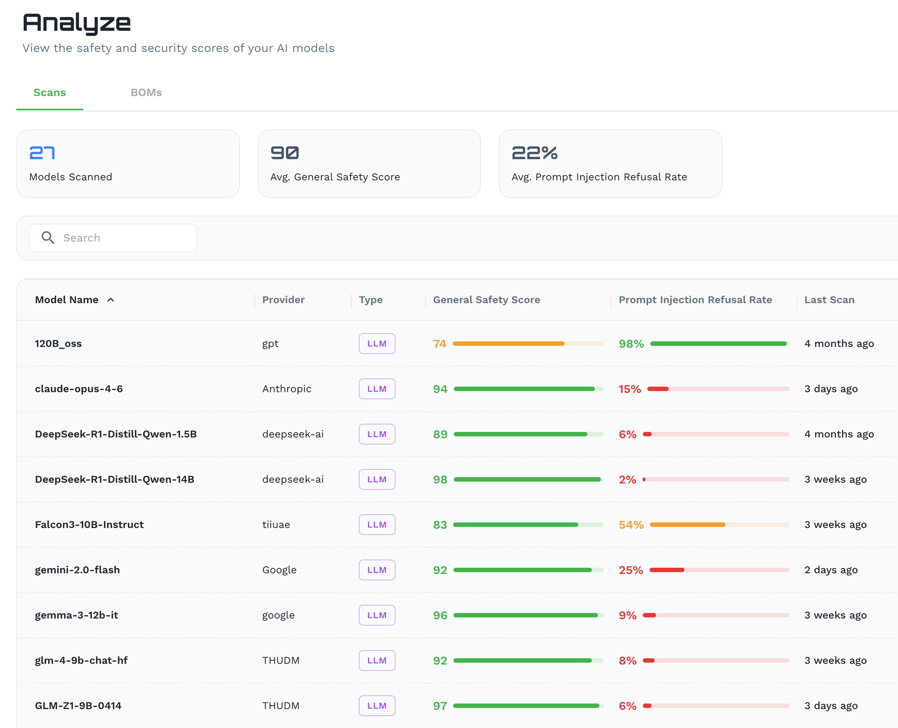
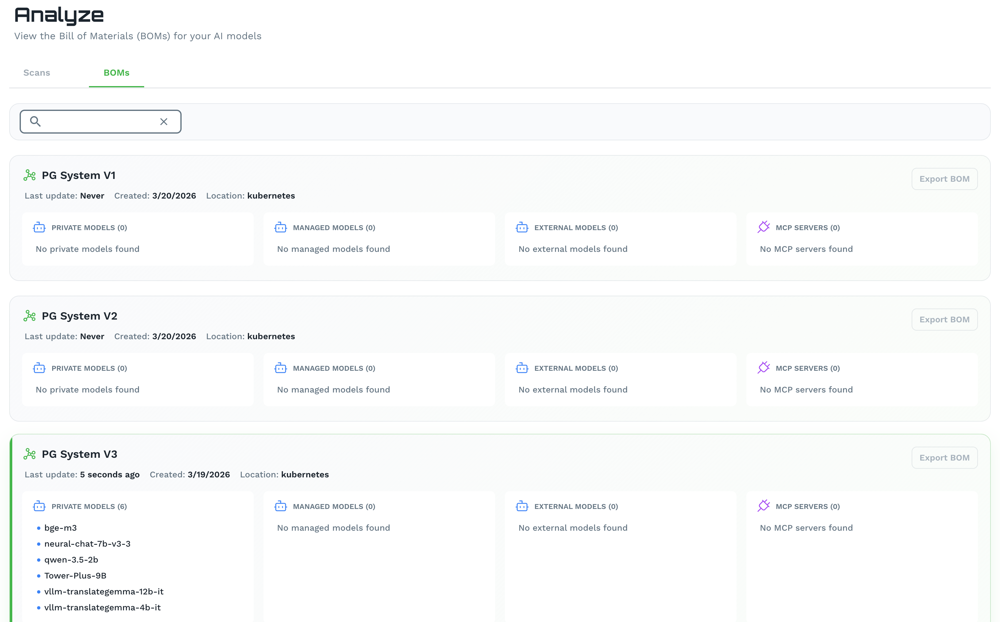
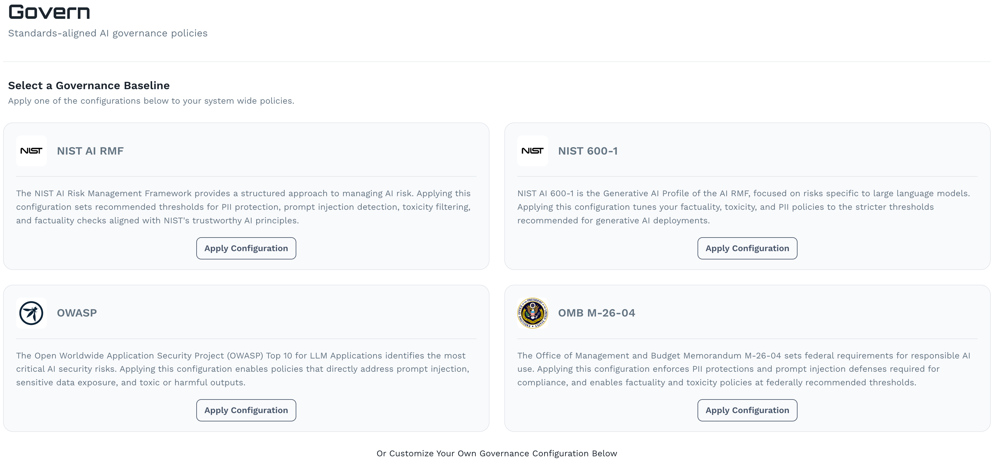
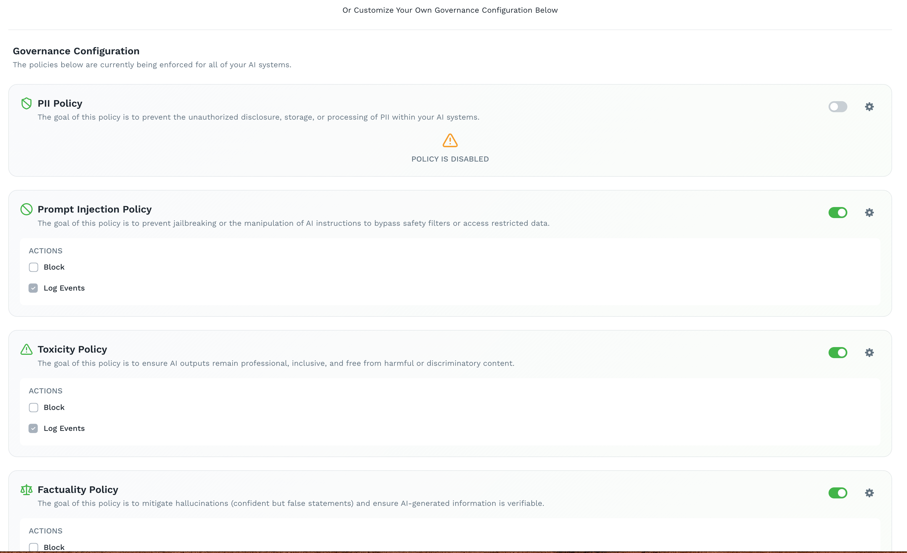

The Prediction Guard Admin Console is your central control plane for managing your sovereign AI systems. From here, you can create and manage multiple systems, deploy any open model, manage API keys, configure MCP servers, apply governance policies, and monitor all activity across your infrastructure.

## Accessing the Admin Console

Once deployed, access the Admin Console at your deployment's URL (e.g. [admin.predictionguard.com](https://admin.predictionguard.com)) and log in with your admin credentials.

## Navigation

The Admin Console sidebar is organized into three groups:

**Systems**
- **Manage** — Create, view, and manage all your AI systems

**Security**
- **Analyze** — Analyze AI interactions for security and compliance signals
- **Monitor** — Real-time monitoring of system usage and performance
- **Govern** — Configure and apply AI governance policies
- **Audit** — Review audit logs and compliance reports

**Settings**
- **Users** — Manage user accounts and access
- **Organizations** — Manage organizational settings and structure

## Systems: Manage

The Systems page is your starting point — a unified view of all AI systems in your Prediction Guard deployment.

Each system card shows:
- **Status**: Health state (Healthy, Never Connected, Degraded)
- **API Keys**: Number of active API keys
- **Models**: Number of deployed models
- **MCP Servers**: Number of connected MCP servers
- **Location**: Deployment environment (e.g. `kubernetes`, `staging`)
- **Last Update**: Time of last heartbeat from the system

Click **Manage** on any system card to open its management dashboard, where you can configure API keys, models, MCP servers, and advanced settings. Click **Create System** to add a new system.

## Security: Analyze

The Analyze section gives you visibility into the safety and composition of all AI models across your systems. It has two tabs: **Scans** and **BOMs**.

### Scans

The Scans tab shows safety and security scores for every AI model in your deployment. At a glance you can see:

- **Models Scanned**: Total number of models that have been analyzed
- **Avg. General Safety Score**: Average safety score across all scanned models (0–100)
- **Avg. Prompt Injection Refusal Rate**: How reliably models resist prompt injection attempts on average

The model table breaks this down per model, showing **Provider**, **Type**, **General Safety Score**, **Prompt Injection Refusal Rate**, and **Last Scan** date. Use this to compare models, identify weaker performers, and make informed decisions about which models to deploy in sensitive environments.

### BOMs (Bill of Materials)

The BOMs tab provides a Bill of Materials for each AI system — a full inventory of everything running in that system:

- **Private Models**: Models you have deployed from your own repositories
- **Managed Models**: Models managed and maintained by Prediction Guard
- **External Models**: Third-party models connected to your system
- **MCP Servers**: Connected Model Context Protocol servers

See [Model Management](/admin/administration/model-management) for a full guide to deploying all three model types.

Each system has an **Export BOM** button to download a full inventory report — useful for compliance audits, vendor assessments, and internal governance reviews.

## Security: Monitor

The Monitor section provides real-time observability into your AI systems — tracking request volumes, latency, model performance, and resource utilization. Use this to detect anomalies, track usage trends, and ensure your systems are operating within expected parameters.

## Security: Govern

The Govern section is where you configure and apply AI governance policies system-wide. Policies set here are enforced across all agents and models within your systems without requiring per-agent configuration.

### Governance Baselines

Prediction Guard ships with four pre-built governance baselines you can apply with a single click:

| Baseline | Description |
|----------|-------------|
| **NIST AI RMF** | The NIST AI Risk Management Framework. Sets recommended thresholds for PII protection, prompt injection detection, toxicity filtering, and factuality checks aligned with NIST's trustworthy AI principles. |
| **NIST 600-1** | The Generative AI Profile of the AI RMF, focused on risks specific to large language models. Tunes factuality, toxicity, and PII policies to stricter thresholds recommended for generative AI deployments. |
| **OWASP** | Based on the OWASP Top 10 for LLM Applications. Directly addresses prompt injection, sensitive data exposure, and toxic or harmful outputs. |
| **OMB M-26-04** | The Office of Management and Budget Memorandum M-26-04, which sets federal requirements for responsible AI use. Enforces PII protections, prompt injection defenses, and factuality/toxicity policies at federally recommended thresholds. |

Click **Apply Configuration** on any baseline to apply it as your system-wide governance policy.

### Custom Governance Configuration

Below the baselines, the **Governance Configuration** section lets you fine-tune individual policies. Each policy can be independently enabled or disabled, and configured with specific actions:

| Policy | Purpose | Available Actions |
|--------|---------|-------------------|
| **PII Policy** | Prevent unauthorized disclosure, storage, or processing of PII within your AI systems | Block, Log Events |
| **Prompt Injection Policy** | Prevent jailbreaking or manipulation of AI instructions to bypass safety filters or access restricted data | Block, Log Events |
| **Toxicity Policy** | Ensure AI outputs remain professional, inclusive, and free from harmful or discriminatory content | Block, Log Events |
| **Factuality Policy** | Mitigate hallucinations and ensure AI-generated information is verifiable | Block |

<Callout intent="info">
Applying a governance baseline will pre-configure these toggles to the recommended settings for that standard. You can then adjust individual policies from the custom configuration below.
</Callout>

## Security: Audit

The Audit section provides a tamper-evident log of all significant actions and interactions across your Admin Console — including system changes, model deployments, API key activity, and user actions. Use this for compliance reporting, incident investigation, and access reviews.

## Settings: Users

Manage user accounts that have access to the Admin Console. From here you can invite new administrators, update roles, and revoke access.

## Settings: Organizations

Configure organizational settings including your organization's name, structure, and any organization-wide defaults that apply across all systems.

---

**Need help?** Contact our support team or join our Discord community for assistance.
