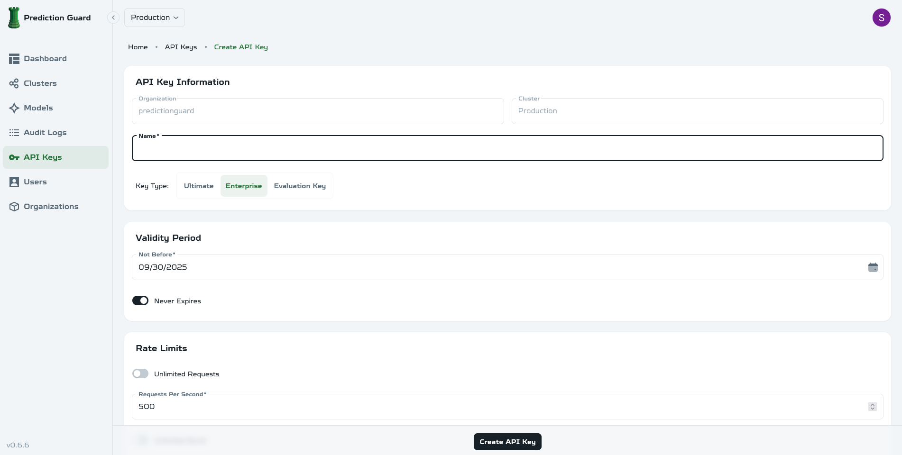

# API Key Management

Manage API keys for secure access to your self-hosted Prediction Guard instance.

## Creating API Keys



### Basic API Key Creation

1. **Navigate to API Keys** in the admin panel
2. **Click "Create New Key"**
3. **Enter key details**:
   - Name (for identification)
   - Description (optional)
   - Expiration date (optional)
4. **Configure permissions** and access levels
5. **Set rate limits** and usage quotas
6. **Generate and copy** the API key securely

### API Key Types

#### Admin Keys
- **Full access** to all features and models
- **Management capabilities** (deploy models, manage users)
- **System configuration** access
- **Use for** administrative tasks and system management

#### User Keys
- **Limited access** to specific models or features
- **Read-only** or read-write permissions
- **Rate limited** based on user tier
- **Use for** application integration and API access

#### Service Keys
- **Application-specific** access patterns
- **High rate limits** for production workloads
- **Specific model access** only
- **Use for** production applications and services

## API Key Configuration

### Permissions
- **Model access** - which models can be used
- **Feature access** - which API endpoints are available
- **Admin access** - management and configuration rights
- **Read/write** - data modification permissions

### Rate Limits
- **Requests per minute** - API call frequency limits
- **Requests per hour** - hourly usage quotas
- **Requests per day** - daily usage limits
- **Concurrent requests** - simultaneous request limits

### Usage Quotas
- **Token limits** - maximum tokens per request
- **Monthly usage** - total usage per month
- **Cost limits** - maximum spending per period
- **Feature limits** - specific feature usage caps

## API Key Security

### Best Practices
- **Store keys securely** - use environment variables or secure vaults
- **Rotate keys regularly** - change keys periodically
- **Monitor usage** - track API key activity and usage
- **Revoke unused keys** - remove keys that are no longer needed

### Security Features
- **Key expiration** - automatic expiration of old keys
- **Usage monitoring** - track and alert on unusual activity
- **IP restrictions** - limit access to specific IP addresses
- **Audit logging** - log all API key usage and changes

## Managing API Keys

### Key Operations
- **View key details** - see configuration and usage stats
- **Update permissions** - modify access levels and limits
- **Regenerate keys** - create new keys with same permissions
- **Revoke keys** - immediately disable key access
- **Delete keys** - permanently remove keys

### Bulk Operations
- **Export key list** - download key information
- **Bulk permission updates** - update multiple keys at once
- **Bulk revocation** - disable multiple keys
- **Key migration** - move keys between environments

## Monitoring and Analytics

### Usage Tracking
- **Request counts** - total API calls per key
- **Response times** - API performance metrics
- **Error rates** - failed request tracking
- **Cost tracking** - usage-based billing information

### Alerts and Notifications
- **Usage threshold** alerts - when limits are approached
- **Unusual activity** detection - suspicious usage patterns
- **Key expiration** warnings - upcoming key expirations
- **Security events** - failed authentication attempts

## Integration Examples

### Environment Variables
```bash
export PREDICTION_GUARD_API_KEY="your-api-key-here"
export PREDICTION_GUARD_URL="https://your-domain.com"
```

### Python SDK
```python
import os
from predictionguard import PredictionGuard

# Set API key as environment variable
os.environ["PREDICTIONGUARD_API_KEY"] = "your-api-key-here"

# Create client
client = PredictionGuard()

# Use the API
result = client.chat.completions.create(
    model="{{TEXT_MODEL}}",
    messages=[
        {
            "role": "user",
            "content": "Hello, world!"
        }
    ],
    max_completion_tokens=100
)
```

### cURL Example
```bash
curl -X POST "https://api.predictionguard.com/chat/completions" \
  -H "Authorization: Bearer your-api-key-here" \
  -H "Content-Type: application/json" \
  -d '{
    "model": "{{TEXT_MODEL}}",
    "messages": [
      {
        "role": "user",
        "content": "Hello, world!"
      }
    ],
    "max_completion_tokens": 100
  }'
```

---

**Complete documentation coming soon** - Advanced API key management features and integration guides are being developed.
