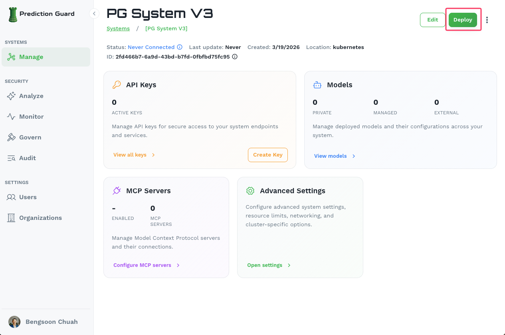
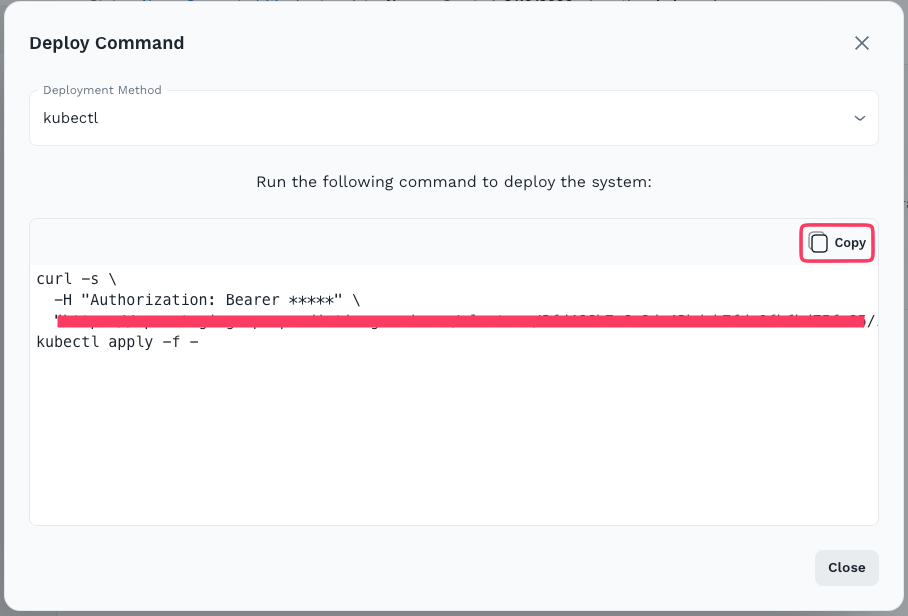
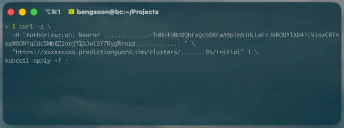
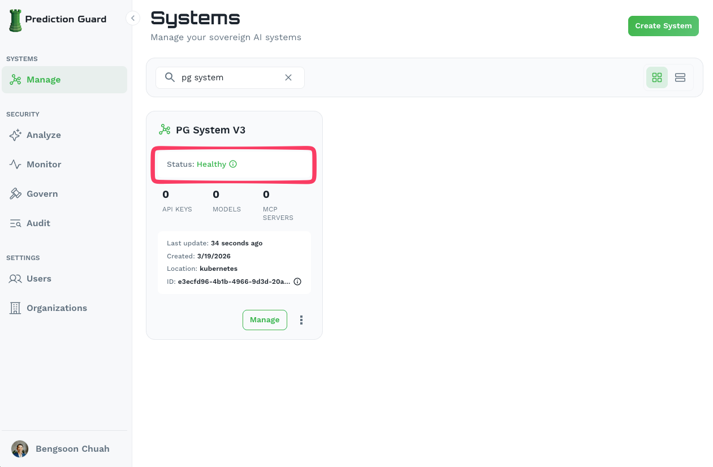
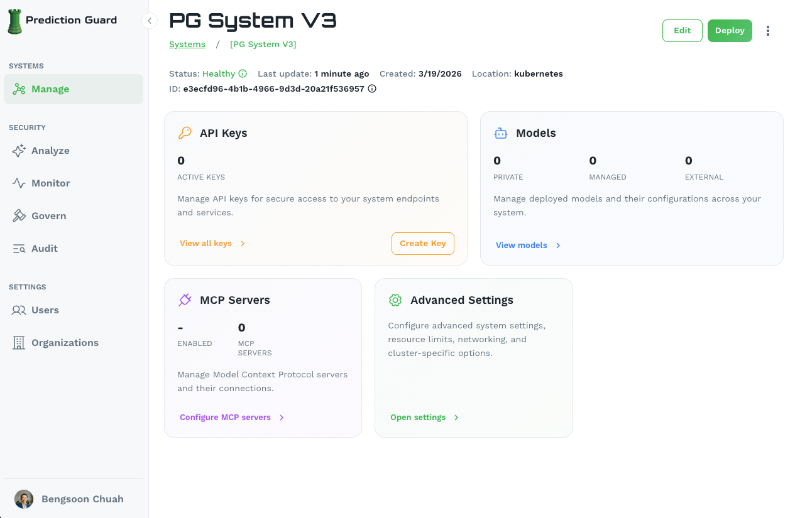

## Prerequisites

- **Azure subscription** with appropriate permissions
- **Azure CLI** installed and configured
- **kubectl** configured for your AKS cluster
- **Access to Unified CX** at admin.predictionguard.com

## Deployment Process

### 1. Create AKS Cluster

Create an Azure Kubernetes Service cluster:

```bash
# Set your cluster name that reflects the AI system on the Unified CX
export CLUSTER_NAME=<your-ai-system-name>

# Set your resource group (use an existing one or create a new one)
export RESOURCE_GROUP=<your-resource-group>
az group create --name $RESOURCE_GROUP --location eastus

# Create AKS cluster
az aks create \
    --resource-group $RESOURCE_GROUP \
    --name $CLUSTER_NAME \
    --node-count 3 \
    --node-vm-size Standard_D2s_v3 \
    --enable-addons monitoring \
    --generate-ssh-keys
```

### 2. Configure kubectl

```bash
# Get credentials
az aks get-credentials --resource-group $RESOURCE_GROUP --name $CLUSTER_NAME

# Verify connection
kubectl get nodes
```

### 3. Set Azure-Specific Configuration
- **Node Pools**: Configure your AKS node pools
- **Storage Classes**: Use Azure Disk CSI driver for persistent volumes
- **Load Balancer**: Configure Azure Load Balancer for ingress
- **Virtual Network**: Specify your VNet and subnet configuration

### 4. Create an AI System in the Unified CX

If you have not already created your AI system in the Unified CX, follow the [Quick Start](/unified-cx/getting-started/quick-start) or the [Custom System](/unified-cx/administration/create-an-ai-system) guide to create your system and generate the installation command.

### 5. Get the Deployment Command

Navigate to your system in the Unified CX and click the **Deploy** button in the top-right corner of the system management page.



This opens the **Deploy Command** modal. Select **kubectl** as the deployment method, then click **Copy** to copy the generated installation command.



### 6. Execute the Installation on Your Cluster

Paste and run the copied command on a machine with `kubectl` access to your AKS cluster. The command authenticates with your Prediction Guard instance and bootstraps all services into the `predictionguard` namespace.



After a few minutes, verify the installation:

```bash
kubectl get pods -n predictionguard
```

You should see running pods including `pg-inside`, indicating the system has been successfully installed. The system will also show as **Healthy** in the Unified CX.



## Configuring Ingress and Reverse Proxy

Prediction Guard comes preconfigured for NGINX and a default Ingress which can be enabled on the system within the **Edit** section of the Systems page. Here you can configure the desired domain names and have NGINX deploy into the `predictionguard` namespace with preconfigured settings for the Prediction Guard API. Then, simply ensure that your DNS entry is routable to the ingress IP on your Kubernetes cluster or load balancer in Azure.

## Post-Deployment

Once deployed, your system is fully manageable from the Unified CX dashboard.



From here you can:

- **API Keys**: Manage API keys for secure access to your system endpoints
- **Models**: Deploy [private, managed, or external models](/unified-cx/administration/model-management) and their configurations
- **MCP Servers**: Configure Model Context Protocol servers and their connections
- **Advanced Settings**: Configure system settings, resource limits, networking, and cluster-specific options

### Azure Integration

Your deployment automatically integrates with:

- **Azure Disk**: Persistent storage for models and data
- **Azure Load Balancer**: Load balancing for high availability
- **Azure Monitor**: Monitoring and logging
- **Azure Active Directory**: Service account and role management

---

**Need help?** Contact our support team for assistance with your Azure deployment.
