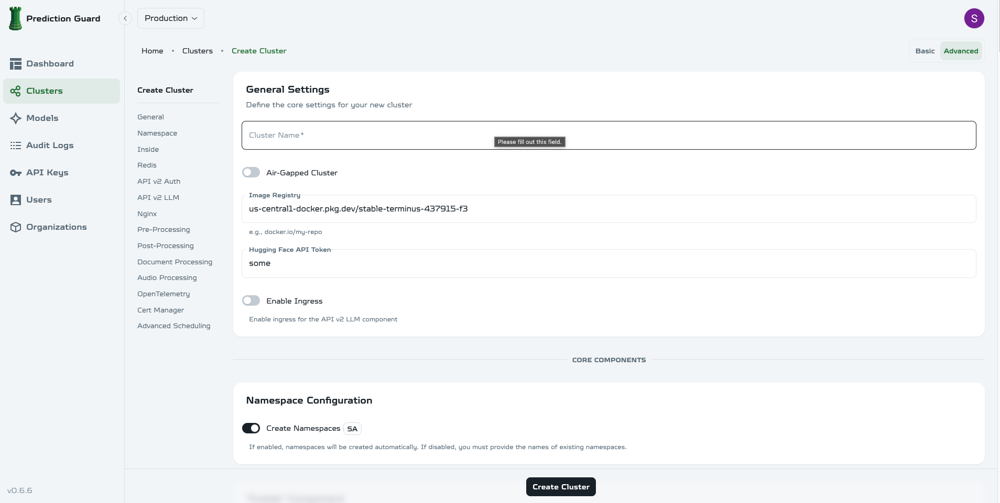

# Cluster Management

Prediction Guard allows you to create and manage multiple clusters, giving you the flexibility to organize your infrastructure based on teams, environments, or use cases.

## Creating a New Cluster

### Cluster Configuration

When creating a new cluster, you can configure:

- **Cluster Name**: A descriptive name for your cluster
- **Environment**: Development, staging, or production
- **Resource Allocation**: CPU, memory, and GPU requirements
- **Security Settings**: Access controls and network policies
- **Model Deployment**: Which models will be available in this cluster

### Cluster Types

#### Development Clusters
- **Purpose**: Testing and development
- **Resources**: Lower resource allocation
- **Access**: Developer team access
- **Models**: Experimental and development models

#### Production Clusters
- **Purpose**: Live production workloads
- **Resources**: High availability and performance
- **Access**: Restricted admin access
- **Models**: Production-ready, validated models

#### Specialized Clusters
- **Purpose**: Specific use cases (e.g., fine-tuned models)
- **Resources**: Optimized for specific workloads
- **Access**: Team-specific access
- **Models**: Custom or industry-specific models

## Managing Existing Clusters

### Cluster Overview
- **Health Status**: Monitor cluster health and performance
- **Resource Usage**: Track CPU, memory, and GPU utilization
- **Model Status**: View deployed models and their status
- **Activity Logs**: Review recent cluster activity

### Cluster Operations

#### Scaling
- **Horizontal Scaling**: Add or remove nodes
- **Vertical Scaling**: Adjust resource allocation
- **Auto-scaling**: Configure automatic scaling based on demand

#### Maintenance
- **Updates**: Apply system and model updates
- **Backups**: Configure and manage backups
- **Monitoring**: Set up alerts and monitoring

#### Security
- **Access Control**: Manage user permissions
- **Network Policies**: Configure network security
- **Audit Logs**: Review security-related activities

## Best Practices

### Cluster Organization
- **Naming Convention**: Use consistent naming for easy identification
- **Environment Separation**: Keep development and production separate
- **Resource Planning**: Plan resources based on expected workloads
- **Documentation**: Document cluster purposes and configurations

### Security
- **Access Control**: Implement least-privilege access
- **Network Security**: Use proper network segmentation
- **Regular Audits**: Review access and permissions regularly
- **Monitoring**: Set up comprehensive monitoring

### Performance
- **Resource Optimization**: Right-size your clusters
- **Model Placement**: Deploy models on appropriate hardware
- **Load Balancing**: Distribute workloads effectively
- **Monitoring**: Track performance metrics and optimize

## Troubleshooting

### Common Issues
- **Resource Constraints**: Monitor and adjust resource allocation
- **Network Connectivity**: Check network configurations
- **Model Deployment**: Verify model compatibility and resources
- **Access Issues**: Review user permissions and authentication

### Support
- **Logs**: Check cluster and application logs
- **Metrics**: Review performance and health metrics
- **Documentation**: Consult relevant documentation
- **Support Team**: Contact support for complex issues
