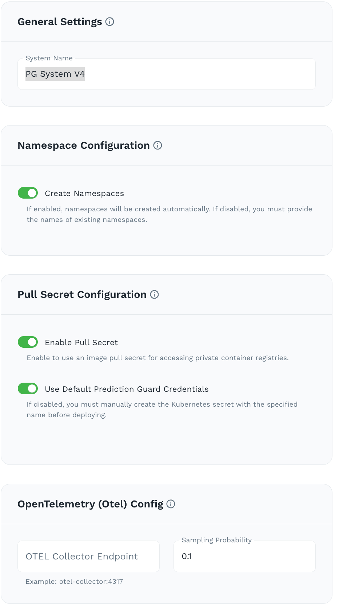
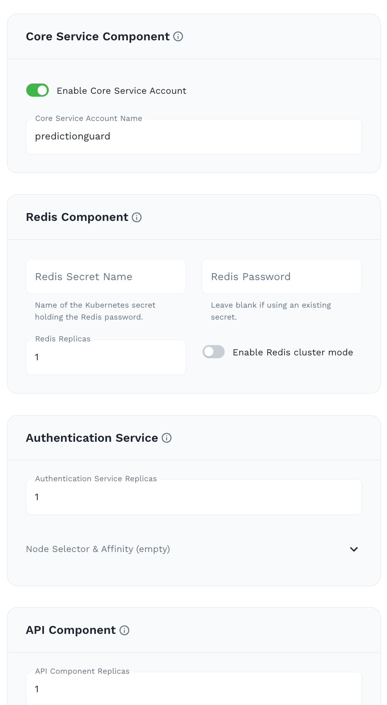
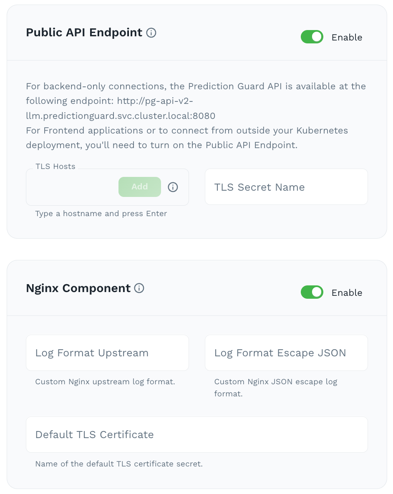
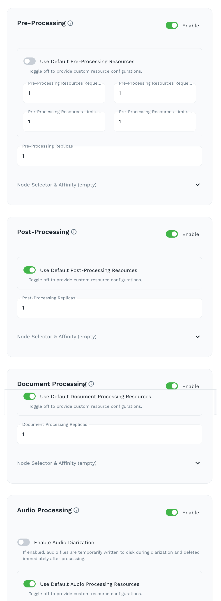
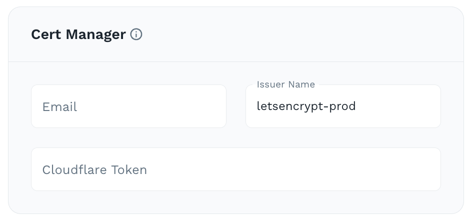
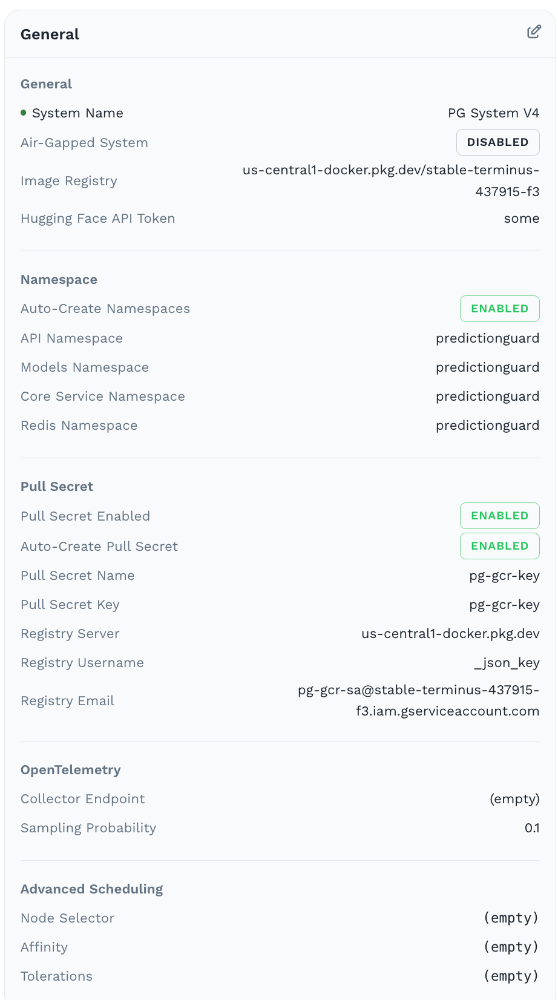

# Create Custom AI System in Admin Console

1. Click **"Create System"** from the dashboard
2. Select **"Custom"** mode for full configuration
3. Select **"Air-Gapped"** for isolated environment with no external network access or  **"Normal"** for standard ddeployment with external network access.

## General Settings

- **System Name**: Choose a unique name (e.g., `pg-system-v3`)
- **Namespace Configuration**: Enable automated Kubernetes namespaces creation.
- **Pull Secret Configuration**: "Enable Pull Secret" to use image pull secret for accessing private container registries. "Use Default Prediction Guard Credentials" to automatically create Kubernetes secret with the specified name. 
- **OpenTelemetry (Otel) Config**: Enter your OTEL Collector Endpoint to enable distributed tracing and observability for your AI system. 
- **Advanced Scheduling**: Configure Kubernetes scheduling constraints for all system components, including node selectors, tolerations and affinity rules.

## Core Components

 
- **Core Service Component**: Enable a centralized core service that orchestrates all system operations.
- **Redis Component**: Leave blank for default Redis deployment or provide custom Redis connection details.
- **Authentication Service**: Default of 1 replica
- **API Component**: Default of 1 replica

## Ingress

- **Public API Endpoint**: Enable for external API access. Add TLS hosts and TLS secret name
- **Nginx Component**: Enable for reverse proxy and load balancing

## Data Processing

Use Default for all resources for standard deployment.
- **Pre-Processing**: Enable for pre-processing tools like PII anonymization and Prompt Injection Detection.
- **Post-Processing**: Enable for post-processing tools like factuality check and toxicity filtering. 
- **Document Processing**: Enable for document processing for extraction and analysis of text from various file formats (PDFs, images, Word documents)
- **Audio Processing**: Enable for audio processing for transcription and analysis of audio files. Also supports audio diarization.

## Operations

- **Cert Manager**: Enter your Cert Manager configurations to automate the provisioning and renewal of SSL/TLS certificates for your system. It integrates with certificate authorities like Let's Encrypt to ensure secure HTTPS connections without manual certificate management.

<Callout intent="warn">
If you enabled a **Public API Endpoint** with TLS hosts in the Ingress section, make sure your DNS records for those hostnames point to the NGINX ingress IP address on your cluster. Without this, external traffic will not route correctly to your AI system.
</Callout>

## Review

Review your configurations and click **"Create System"** to register your system and generate the deployment command. You can then use this command to deploy your system in your environment.