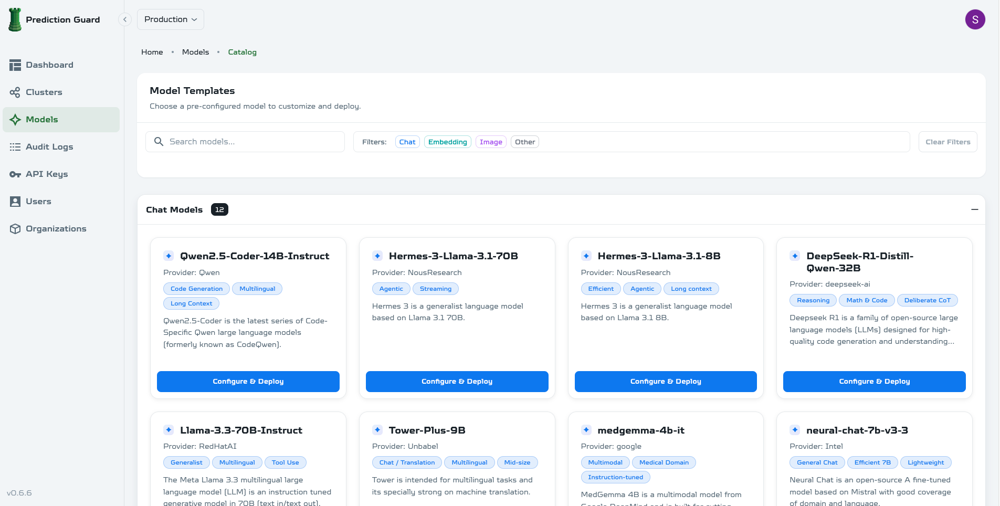

# Model Management

Deploy and configure models in your Prediction Guard platform.

## Model Deployment

### Deploy from Hugging Face

1. **Browse the model library** in the admin panel
2. **Search for models** by name or type
3. **Click Deploy** and configure settings
4. **Monitor deployment** progress
5. **Test the model** via API

### Upload Custom Models

1. **Upload model files** to your platform
2. **Configure model settings** (name, description, capabilities)
3. **Set resource requirements** (CPU, GPU, memory)
4. **Deploy and test** the model
5. **Make available** to API users

## Model Configuration

### General Settings
- **Select from Catalog**: Choose from available model catalog
- **Model Name**: Display name for the model
- **Description**: Model description and capabilities
- **Container Image URL**: Custom container image (optional)
- **Replicas**: Number of model instances to run
- **Enable Model**: Toggle model availability
- **Runtime Class Name**: Kubernetes runtime class

### Model Parameters
- **Model CPU (millicores)**: CPU allocation for the model server
- **Model Memory (GB)**: RAM allocation for the model
- **Accelerator Cards**: Number of GPUs to allocate
- **Card Type**: GPU type (NVIDIA, etc.)
- **Hugepages (GB)**: Memory optimization settings
- **Max Input Tokens**: Maximum input context length
- **Max Total Tokens**: Maximum total tokens per request
- **Min Input Tokens**: Minimum input tokens required
- **Max Client Batches**: Maximum concurrent client batches
- **Aliases**: Model aliases (one per line)

### Model Capabilities
- **Streaming**: Enable streaming responses
- **Tool Use**: Enable tool/function calling capabilities
- **Image Input**: Enable image processing capabilities
- **Image Formats**: Supported image formats (PNG, JPEG, etc.)
- **Capabilities**: Model capabilities (embedding, chat, etc.)

### Advanced Configuration
- **Container Execution**: Define container command and arguments
- **Environment Variables**: Set environment variables (YAML)
- **K8s Resource Limits**: Configure Kubernetes resource limits (YAML)
- **K8s Scheduling**: Control pod placement with selectors and affinity
- **K8s Storage**: Configure and mount storage volumes
- **K8s Health Probes**: Configure liveness and readiness probes
