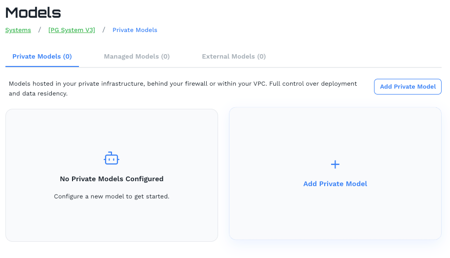
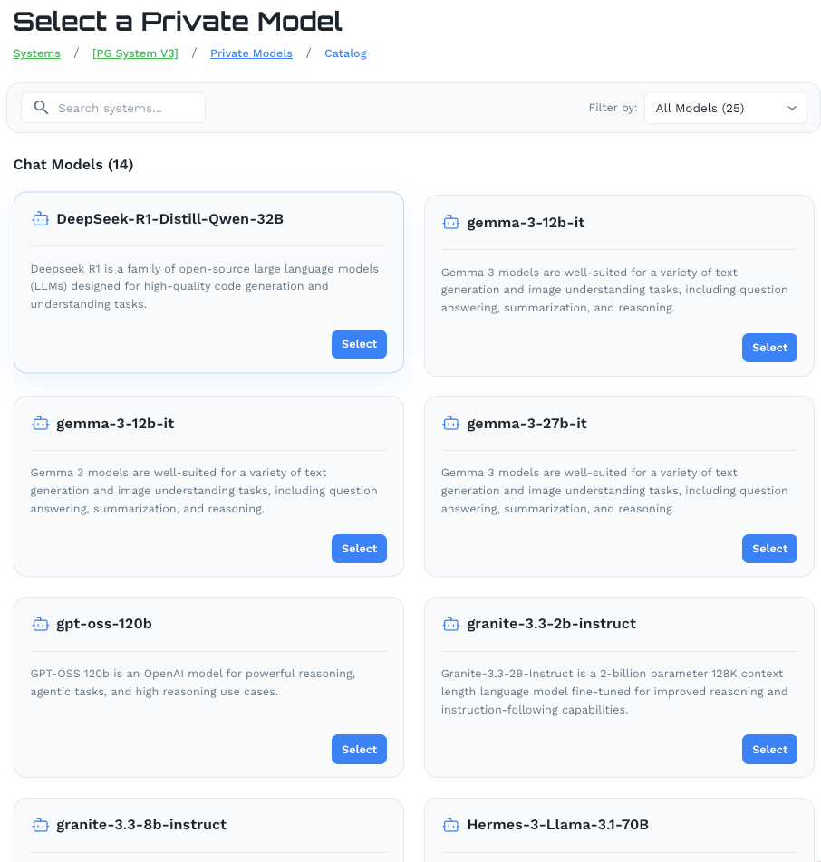
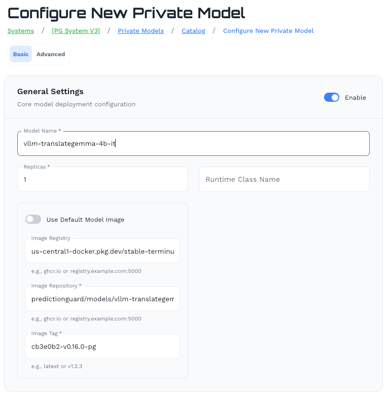
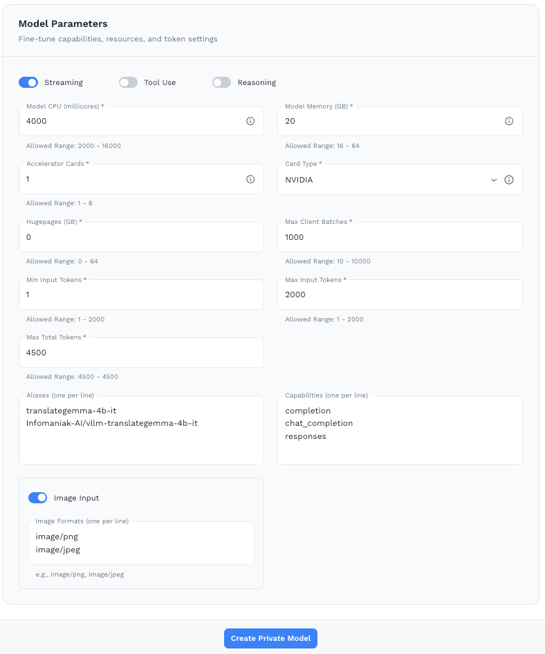
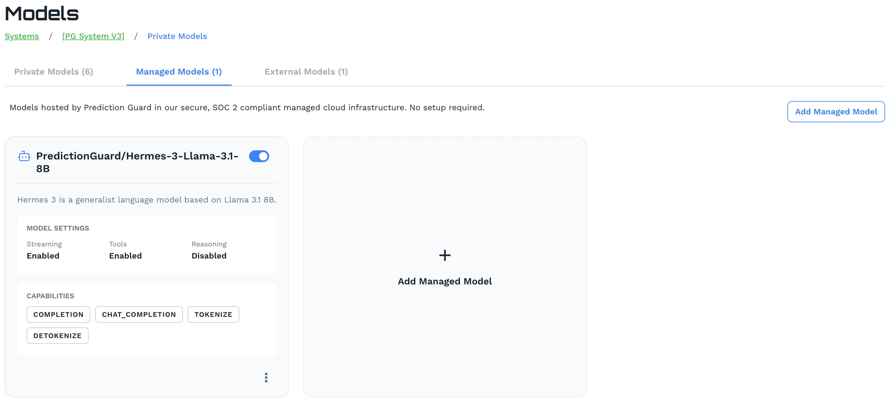
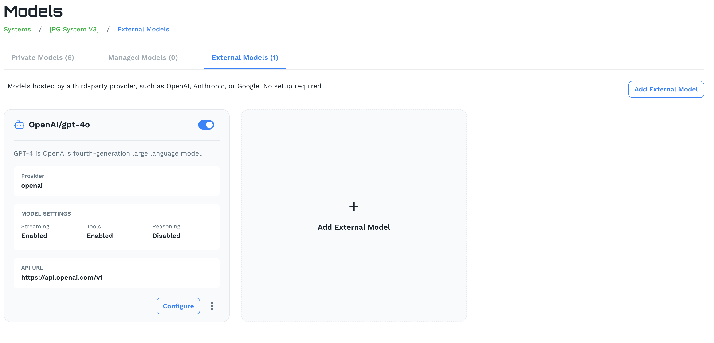

Prediction Guard supports three types of models, all accessible through the **Models** section of your system's management dashboard. Regardless of type, every model inherits your AI system's governance policies, safeguards, and integrations automatically.

| Type | Hosted By | Setup Required | License |
|------|-----------|---------------|---------|
| **Private** | Your own infrastructure | Yes | Included |
| **Managed** | Prediction Guard (SOC 2) | No | Managed Models license required |
| **External** | Third-party provider (OpenAI, Anthropic, etc.) | No | Included |

## Private Models

Private models run within your own infrastructure — behind your firewall or within your VPC. You have full control over deployment and data residency.

All models in the Prediction Guard catalog are **curated, scanned, and tested** before being made available. This means every model you deploy has been evaluated for safety, security vulnerabilities, and performance characteristics — so you're not pulling arbitrary weights from a public registry.

Click **Add Private Model** to open the model catalog.

Browse the catalog and select a model. The catalog is organized by type (Chat Models, Embedding Models, etc.) and each entry includes a description of the model's intended use. Then configure the model across two tabs:

### General Settings

- **Model Name**: Identifier for this model deployment
- **Replicas**: Number of instances to run
- **Runtime Class Name**: Kubernetes runtime class (optional)
- **Model Image**: Use the default Prediction Guard image or provide a custom registry, repository, and tag

### Model Parameters

<Callout intent="warning">
Make sure your node is sized appropriately for the model you've selected before setting these values.
</Callout>

- **Model CPU (millicores)** — Allowed range: 2000–16000
- **Model Memory (GB)** — Allowed range: 16–64
- **Accelerator Cards** — Number of GPUs (1–8)
- **Card Type** — GPU type (e.g. NVIDIA)
- **Hugepages (GB)** — Memory optimization (0–64)
- **Max Client Batches** — Max concurrent client batches (10–10000)
- **Min / Max Input Tokens** — Token range for inputs (1–2000)
- **Max Total Tokens** — Maximum total tokens per request
- **Aliases** — Alternative names for this model (one per line)
- **Capabilities** — e.g. `completion`, `chat_completion`, `responses`
- **Streaming / Tool Use / Reasoning** — Toggle supported capabilities
- **Image Input** — Enable and specify accepted image formats

Click **Create Private Model** to deploy.

## Managed Models

Managed Models are hosted by Prediction Guard in secure, SOC 2 compliant managed cloud infrastructure. No infrastructure setup or configuration is required on your end.

<Callout intent="info">
Managed Models require an additional **Managed Models license**. Contact your Prediction Guard account team to enable this.
</Callout>

Click **Add Managed Model** to select from the available managed model catalog. Once added, the model card shows:

- **Model Settings**: Streaming, Tools, and Reasoning capabilities
- **Capabilities**: Supported API capabilities (e.g. `COMPLETION`, `CHAT_COMPLETION`, `TOKENIZE`, `DETOKENIZE`, `RESPONSES`, `EMBEDDING`)

Managed models are immediately available via your system's API endpoint with no deployment wait time.

## External Models

External Models connect your Prediction Guard system to models hosted by third-party providers — such as OpenAI, Anthropic, Google, AWS, Azure, and GCP — through their native APIs. No infrastructure setup is required.

Click **Add External Model** to configure a connection. Each external model card displays:

- **Provider**: The external provider (e.g. `openai`, `anthropic`, `google`)
- **Model Settings**: Streaming, Tools, and Reasoning capabilities
- **API URL**: The provider's API endpoint being used

<Callout intent="success">
External models fully inherit your AI system's governance policies, prompt injection protection, PII safeguards, toxicity filtering, and MCP integrations — giving you centralized control over third-party models without any additional configuration.
</Callout>

Use **Configure** on any external model card to update credentials or settings.
