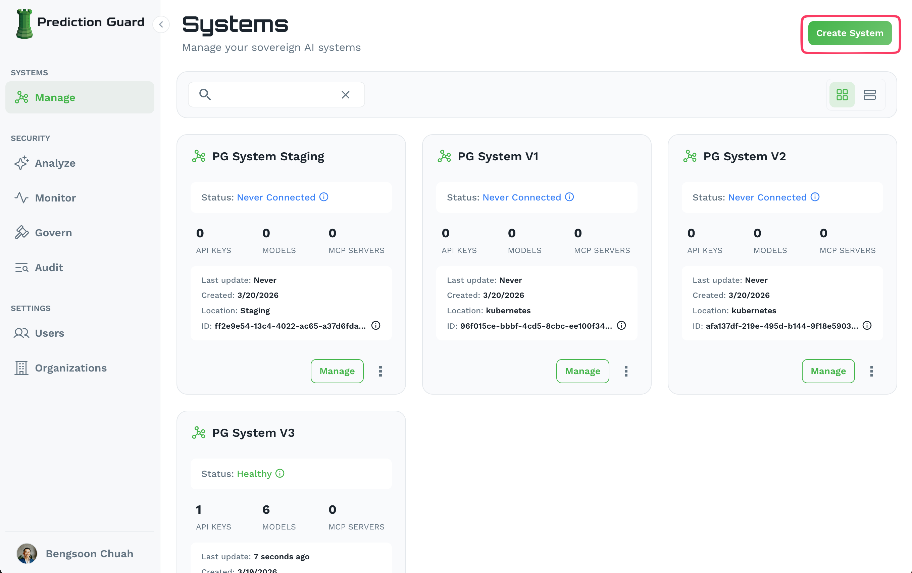
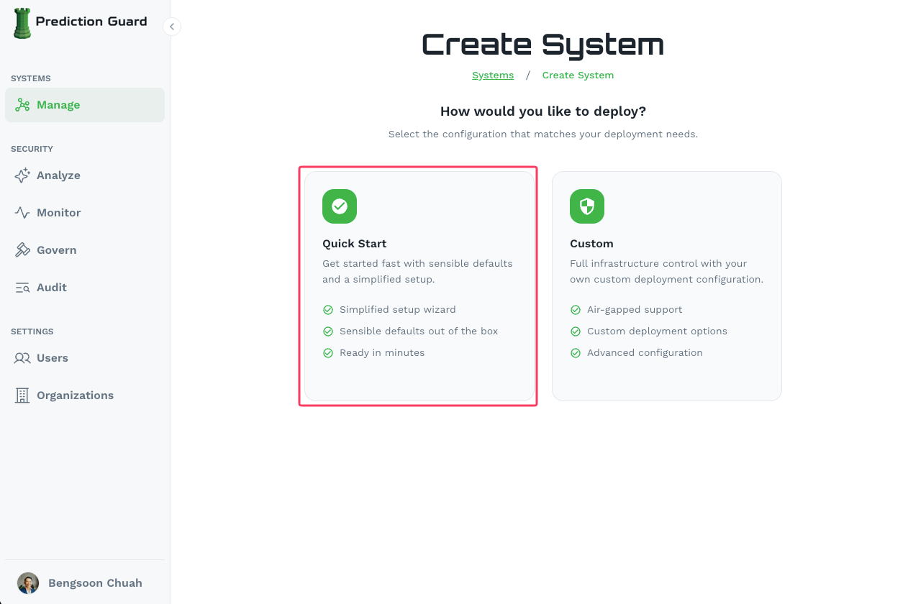
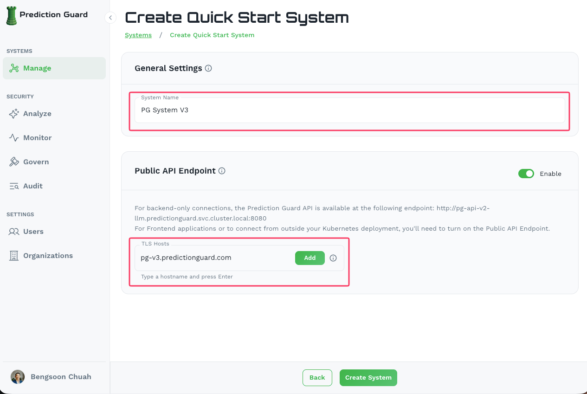

**Manage** and control your AI security by composing sovereign AI Systems that contain internal and external models, MCP servers, and connections to applications.

**Govern**, monitor and audit your AI systems by applying AI governance policies that aligns to NIST, OWASP and OMB out of the box.

**Deploy** AI agents that automatically inherit your system-wide governance and integrate directly with your sovereign AI systems.

<Callout intent="info">
An **AI System** is an abstraction that consolidates your AI models, MCP servers, tool connections, and agent integrations into a single unit. Prediction Guard's control plane, which is self-hosted in your infrastructure, applies your sovereign configuration of access, auditing, governance, and monitoring to each AI system.
</Callout>

## AI System Deployment Options

Prediction Guard supports flexible AI System deployment across different environments:

- **On-Premises**: Deploy in your own data center with Kubernetes or single-node binary
- **Cloud**: Deploy on AWS, Azure, or Google Cloud with managed Kubernetes
- **Air-Gapped**: Deploy in isolated environments with offline packages

## Platform Capabilities

Your deployed Prediction Guard platform provides:

- **Model Management**: Deploy [private models](/admin/administration/model-management#private-models), connect to Prediction Guard's [managed models](/admin/administration/model-management#managed-models), or integrate [external models](/admin/administration/model-management#external-models) such as Azure Foundry, AWS Bedrock, Google Vertex, OpenAI, Anthropic and more
- **System Management**: Create and manage multiple systems across environments
- **Security & Compliance**: Built-in security scanning, audit logs, and compliance features
- **API Management**: Create and manage API keys with granular permissions
- **Integrations**: Connect your AI systems to applications, knowledge bases and MCP servers that will be inherited by the agents that you deploy
- **Governance**: Apply AI governance policies across your systems that aligns with NIST, OWASP and OMB standards
- **Monitoring**: Real-time monitoring and alerting for your AI infrastructure

## Getting Started

<Steps toc={true}>

### Create your first sovereign AI system in the Admin Console

Start by creating your system in the Admin Console:

1. **Navigate to your Admin Console (e.g. [admin.predictionguard.com](https://admin.predictionguard.com))** and log in

2. **Go to Systems → Manage** and click **"Create System"** in the top-right corner

3. **Select "Quick Start"** for a simplified setup with sensible defaults

4. **Fill in your system details:**
   - **System Name**: A unique name for your system (e.g. `production`, `staging`)
   - **Public API Endpoint**: Enable this if you need access from outside your Kubernetes deployment, and add your TLS hostname(s)

5. **Click "Create System"** to create your AI system with default settings

### Choose your deployment method

Prediction Guard can be deployed anywhere that fits your needs. Choose the deployment method that works best for your environment:

#### On-Premises
Deploy in your own data center:
- [Kubernetes Cluster](/admin/installation/on-premises/kubernetes) - Full Kubernetes deployment
- [Zero Dependency Binary](/admin/installation/on-premises/binary) - Single node binary installation

#### Cloud Deployment
Deploy on major cloud providers:
- [AWS Deployment](/admin/installation/cloud/aws) - Amazon Web Services
- [Azure Deployment](/admin/installation/cloud/azure) - Microsoft Azure
- [GCP Deployment](/admin/installation/cloud/gcp) - Google Cloud Platform

#### Air Gapped
Deploy in isolated environments. Note that air-gapped deployment requires **Custom** configuration instead of Quick Start during system creation:
- [Air Gapped Deployment](/admin/installation/air-gapped/air-gapped) - Offline deployment guide

### Deploy your AI system

Follow the specific deployment guide for your chosen environment. When ready, click the **Deploy** button on your system in the Admin Console to get the installation command.

The deployment process will:

1. **Generate an installation command** scoped to your system from the Admin Console
2. **Run the command** on a machine with `kubectl` access to your cluster
3. **Bootstrap your system** — Prediction Guard services will start up in the `predictionguard` namespace

4. **Verify the deployment** — your system will show as **Healthy** in the Admin Console once complete

### Connect an AI model to your system

Once your system is healthy, connect AI models to start building:

1. **External or Managed Models** — Connect to [external models](/admin/administration/model-management#external-models) (e.g. Azure Foundry, AWS Bedrock, Google Vertex, OpenAI, Anthropic, and more) or Prediction Guard's [managed models](/admin/administration/model-management#managed-models) (if available) with no additional infrastructure required.
2. **Private Models** — If you need models running on your own infrastructure, deploy and connect them as [private models](/admin/administration/model-management#private-models).

</Steps>

## Next Steps

Once your system is deployed and healthy, you can configure it further:

- **Deploy models** — Add private, managed, or external models to your system. See the [Model Management](/admin/administration/model-management) guide for details on all three model types.
- **Set up governance** — Apply AI governance policies aligned with NIST, OWASP, and OMB standards. See the [Governance](/admin/administration/admin-console#security-govern) section of the Admin Console guide.
- **Create API keys** — Set up API keys with appropriate permissions for your applications. See the [API Keys](/admin/administration/api-keys) guide.
- **Explore the Admin Console** — Manage systems, monitor activity, and review audit logs. See the full [Admin Console](/admin/administration/admin-console) overview.