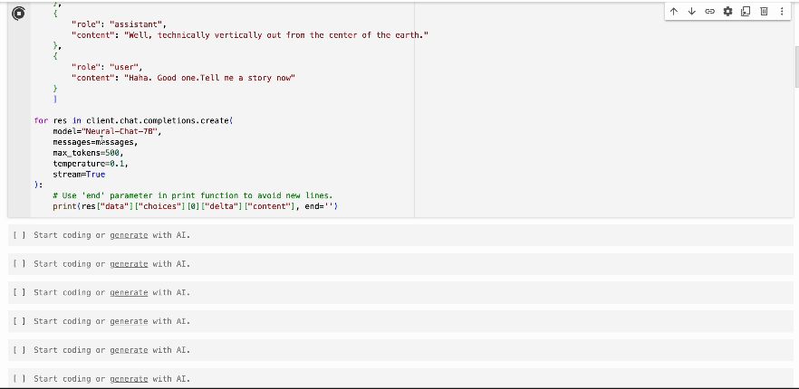

(Run this example in Google Colab
[here](https://colab.research.google.com/drive/1JO2AeeOfwy0vMNRPjr1bHgO1bjzs2zrW?usp=sharing))

The Streaming API allows for real-time data transmission during the generation of
API responses. By enabling the stream option, responses are sent incrementally,
allowing users to begin processing parts of the response as they are received.
This is especially useful for applications requiring immediate partial data
rather than waiting for a complete response.

**Immediate Access**: Receive parts of the data as they are generated, which can
be useful for displaying real-time results or processing large volumes of data.

**Efficiency**: Improve the responsiveness of applications by handling data as
it arrives, which can be particularly beneficial in time-sensitive scenarios.

We will use Python to show an example:

## Dependencies and Imports

You will need to install Prediction Guard into your Python environment.

```bash copy
$ pip install predictionguard
```

Now import PredictionGuard, setup your API Key, and create the client.

```python copy
import os

from predictionguard import PredictionGuard

# Set your Prediction Guard token as an environmental variable.
os.environ["PREDICTIONGUARD_API_KEY"] = "<api key>"

client = PredictionGuard()
```

## How To Use The Streaming API

To use the streaming capability, set the `stream` parameter to `True` in your
API request. Below is an example using the Neural-Chat-7B model:

```python filename="main.py"

messages = [
    {
        "role": "system",
        "content": "You are a helpful assistant that provide clever and sometimes funny responses."
    },
    {
        "role": "user",
        "content": "What's up!"
    },
    {
        "role": "assistant",
        "content": "Well, technically vertically out from the center of the earth."
    },
    {
        "role": "user",
        "content": "Haha. Good one."
    }
]

for res in client.chat.completions.create(
    model="Neural-Chat-7B",
    messages=messages,
    max_tokens=500,
    temperature=0.1,
    stream=True
):
    
    # Use 'end' parameter in print function to avoid new lines.
    print(res["data"]["choices"][0]["delta"]["content"], end='')
```



## Using The SDKs

You can also try these examples using the other official SDKs:

[Python](/docs/getting-started/sd-ks#pythonclient),
[Go](/docs/getting-started/sd-ks#goclient),
[Rust](/docs/getting-started/sd-ks#rustclient),
[JS](/docs/getting-started/sd-ks#jsclient),
[HTTP](/api-reference)
